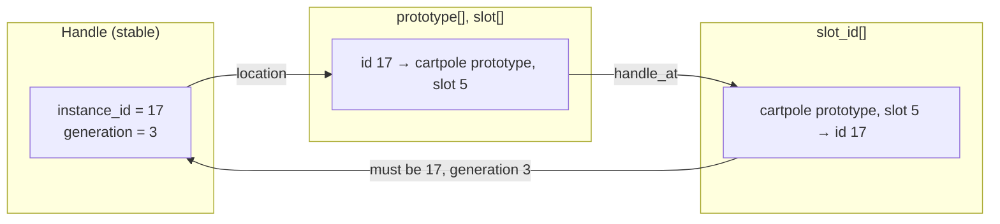

# Handle and location

A world has an identity that does not move and a location that can. The directory stores both relations and checks them against each other on lookup.

`location(data, id, generation)` returns `(prototype, slot, valid)`. It returns invalid if the generation is stale or if the inverse table disagrees with the forward table. `handle_at(data, prototype, slot)` returns `(id, generation, valid)` and checks the forward table. Both are `wp.func`s and can be called from kernels, so a MJWarp kernel that holds a handle can find its world index without a host round trip.

Compaction moves slots and does not change handles. After `publish_compaction`, each live handle resolves to its new slot with the same identity and generation.

Generations do not wrap. Each publication of an identity increments its generation. At the maximum value the identity is retired and never reused. A stale handle therefore cannot match a later lifetime of the same identity.

:::note In Newton
An IsaacLab environment id is mapped to a handle by Newton. When the environment resets into a new world prototype, the handle's identity stays and its generation advances; when the environment is destroyed, the identity is retired. Code that cached the old handle gets `valid = False` from `location`, not another world's state.
:::
