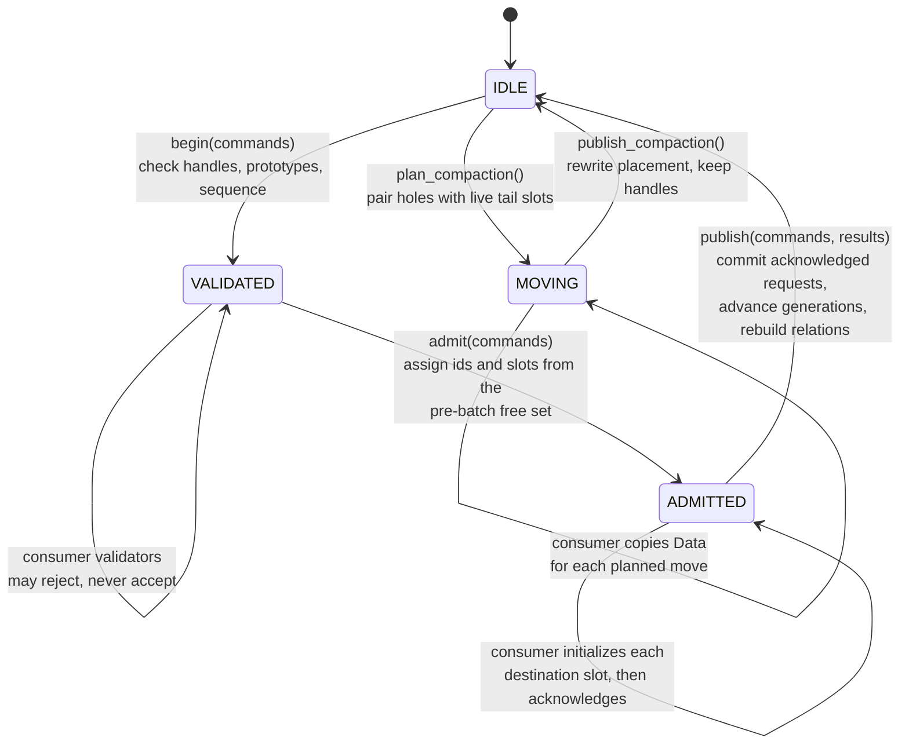

# The lifecycle transaction

Creating, replacing and destroying worlds happens in a batch identified by a sequence number. In Newton a reset is such a batch: the worlds whose episodes ended are destroyed or replaced, and new worlds are created, all in one device transaction. The directory executes the batch in three device stages with consumer work between them.

Three rules make this safe under a captured graph.

**Admission uses a snapshot.** Destinations are drawn only from slots and identities that were free before the batch began. Slots freed by this batch become admissible in the next batch. Released slots and admitted slots are disjoint, so publication has no write conflicts.

**Replay is idempotent.** A batch replayed with the same sequence number returns the previous outcome. A lower sequence number denies advancement. The graph can replay without the host deciding whether the batch is new.

**Publication requires acknowledgement.** A request that was admitted but not acknowledged is rejected with `INITIALIZATION_MISSING`. A slot that was never initialized does not become live.

**Only eligible requests conflict.** Two valid requests on one identity both reject. A stale request on the same identity does not reject a valid one.
