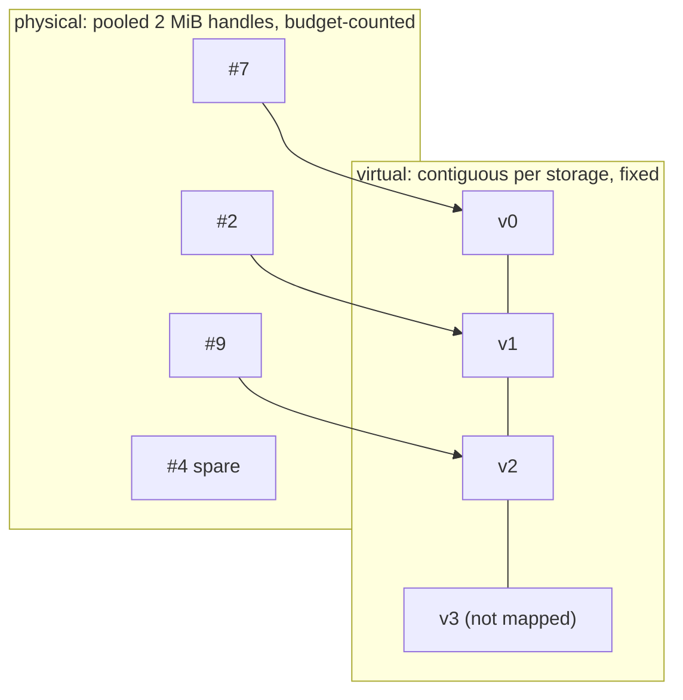

# Virtual and physical memory

Two different things are called "memory" in a growable storage, and the package keeps them apart.

**Virtual address space** is reserved once per `FieldStorage`, as one contiguous range of `capacity × row_stride` bytes rounded up to the driver granule. It never moves and never grows. Slot *i* of a field is always at `base + i × row_stride`, from the first allocation until close. This is what makes growth compatible with captured graphs: a kernel node captured with a pointer into the storage keeps a valid pointer as the population grows, because the pointer was into the reservation, not into whatever happened to be mapped. On current GPUs a process can reserve on the order of 2^47 bytes, so reserving the maximum `nworld` a prototype may ever reach costs nothing physical.

**Physical memory** is a pool of granule handles, 2 MiB each on current drivers, created with `cuMemCreate` and mapped into virtual granules with `cuMemMap`. Handles are discrete and interchangeable. A handle freed when the G1 storage shrinks can later back a cartpole granule. The physical pages behind one storage need not be contiguous and usually are not. The byte budget counts handles, mapped or spare, and nothing else.

The figure keeps the two layers apart. Grow a storage and a handle is drawn from the pool, created if the pool has none and the budget allows, and mapped into the next virtual granule. Shrink one and its last handle returns to the spare pool, still counted until `trim` releases it. The virtual bars never change.

## What follows from the split

| Fact | Consequence |
|---|---|
| Virtual range is fixed | Field arrays, bound views and captured kernel nodes hold stable pointers across growth and shrink |
| Mapping is per granule | Readiness rounds to granules; a 4096-slot cartpole storage at 16 bytes per slot is one granule and is entirely ready at once |
| Handles are pooled | Oscillating populations reuse handles without touching the driver; `trim` is the only release |
| Budget counts handles | A G1 storage at 284 bytes per slot consumes a granule every 7,384 slots; a cartpole storage every 131,072. The same budget holds about sixteen times fewer G1 worlds |
| Virtual is cheap | Reserve for the maximum; there is no reason to size a reservation to the current population |

## What the package does not do

It does not move a reservation. If a storage needs more slots than were reserved, that is a new storage, not a resize; the design treats reservation as a decision made once. It does not share a physical handle between two virtual ranges, so there is no aliasing of one page from two storages. And it does not make a mapped page accessible by itself: `cuMemSetAccess` is a separate step, and the ledger records whether each granule's access was granted, so a failure between map and access is rolled back rather than published.
