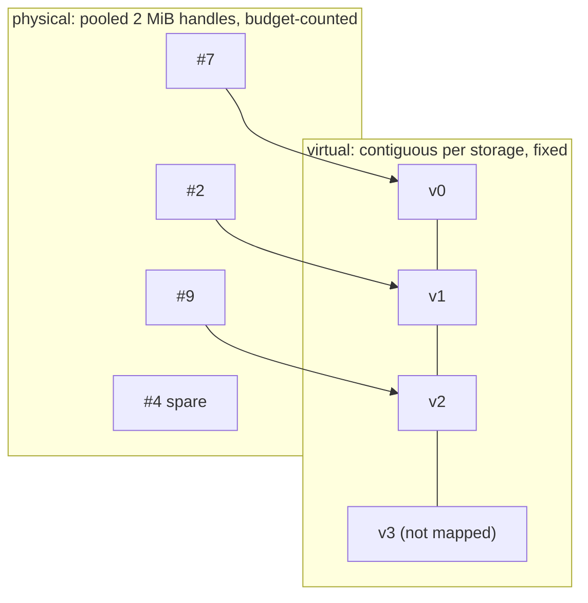

# Virtual and physical memory

Three layers are easy to confuse when a batch's worlds come and go. The directory owns world placement; backing owns virtual reservations and physical mappings. A graph may update placement and data, while host services change mappings.

| Layer | What varies | Who resolves it | When |
|---|---|---|---|
| **Occupancy**: which slots hold a live world | slots 0, 1, 3, 4, 6, 9 may be live while 2, 5, 7, 8 are free | the directory, and either compaction or an indirect index inside the kernel | at reset and compaction |
| **Virtual address**: where slot *i* is | nothing; slot *i* is always `base + i × stride` | fixed at allocation | unchanged until reservation release |
| **Physical pages**: which physical allocation backs each part of the range | pages are pooled and not contiguous | the GPU memory management unit, through page tables set by `cuMemMap` | on every memory access, in hardware |

A kernel launched over indices 0 to `live_count − 1` reads slots 0 to `live_count − 1`. It does not know which slots are live, and nothing translates its indices at launch; the only launch-time change is the count itself. If a live world sits at slot 9 while `live_count` is 6, the kernel skips it. Compaction moves the data so the live worlds occupy the lowest slots; alternatively a kernel can read `live_slots[i]` to find its slot, which is a per-element indirection in the kernel body. Virtual-to-physical translation is a separate matter entirely: the kernel only ever sees virtual addresses, and the hardware resolves them to whichever page is mapped there.

The rest of this page is about the second and third layers.

**Virtual address space** is reserved once per `FieldStorage`, as one contiguous range of `capacity × row_stride` bytes rounded up to the driver page, where `capacity` is the planned maximum number of worlds for that prototype. Its base and extent stay fixed until release. Slot *i* of a field is always at `base + i × row_stride`, from the first allocation until close. This is what makes growth compatible with captured graphs: a kernel node captured with a pointer into the storage keeps the same virtual pointer as the population grows, because the pointer was into the reservation, not into whatever happened to be mapped. Only mapped, accessible rows may be touched. Reservation consumes no payload backing; address space, directory metadata and scan costs still limit the plan.

**Physical memory** is a pool of allocation handles, sized using the granularity queried from CUDA (2 MiB in these figures), created with `cuMemCreate` and mapped into virtual pages with `cuMemMap`. Handles are discrete and interchangeable. A handle freed when the G1 storage shrinks can later back a cartpole page. The physical pages behind one storage need not be contiguous and usually are not. The byte budget counts handles, mapped or spare, and nothing else.

The figure uses illustrative strides of 1.5 KiB for cartpole and 24 KiB for G1; these are not complete engine-memory measurements. Each storage reserves 32 MiB of addresses, so the two reserve 64 MiB against a shared 32 MiB physical budget. The figure starts with a warm pool for clarity. The package itself creates backing on demand and reuses returned handles.

The figure keeps the two layers apart. Growth draws a handle from the pool, or creates one if budget allows, and maps it into the next virtual page. Fresh addresses need no explicit reader join; historical remapping requires maintenance. The shrink animation withdraws a tail, waits for simulated reader completion, then reclaims it to the pool. Driver work still has a cost. The virtual ranges remain fixed until close.

## What follows from the split

| Fact | Consequence |
|---|---|
| Virtual range is fixed | Field arrays, bound views and captured kernel nodes hold stable pointers across growth and shrink |
| Mapping is per page | One illustrative page physically covers 1,365 cartpole rows or 85 G1 rows; readiness can publish a smaller exact prefix |
| Handles are pooled | Reuse can avoid physical allocation, but remapping and access setup still call the driver; `trim` explicitly releases spares |
| Budget counts handles | A G1 storage consumes a page every 85 slots, a cartpole storage every 1,365. The same budget holds sixteen times fewer G1 worlds |
| Virtual is cheap | Reserve the whole budget for every prototype, so each could hold it alone. What stops the reservation from being larger still is directory metadata and per-batch scan cost, not address space; see below |

## Why not reserve more

Reservation is cheap, so the ceiling could be much higher. Several costs stop it from being unlimited:

- **Address space is finite.** Available virtual address space depends on the platform. Many prototypes, each with several reservations, consume it even without physical backing.
- **Directory metadata is physical and sized by capacity.** Each slot costs about 28 bytes of ordinary GPU memory and each identity about 24, before any world exists. A directory for a million slots and two million identities holds about 76 MB. The storage reservation is free; the directory that indexes it is not.
- **Publication scans capacity.** `publish` and compaction rescan identity and slot capacity on every batch, so unused capacity has a per-step cost today. Slots, strides and launch dimensions are also int32, which caps one storage at about two billion slots.

Choose capacities that cover the intended mixes while accounting for metadata and scan cost. The figures reserve a budget-sized range for every prototype as one possible policy. Real engine state spans several storage domains and includes allocations outside the backing budget. Growing beyond a reservation requires new storage and preparation.

## What the package does not do

It does not move a reservation. If a storage needs more slots than were reserved, that is a new storage, not a resize; the design treats reservation as a decision made once. It does not share a physical handle between two virtual ranges, so there is no aliasing of one page from two storages. And it does not make a mapped page accessible by itself: `cuMemSetAccess` is a separate step, and the ledger records whether each page's access was granted, so a failure between map and access is rolled back rather than published.
