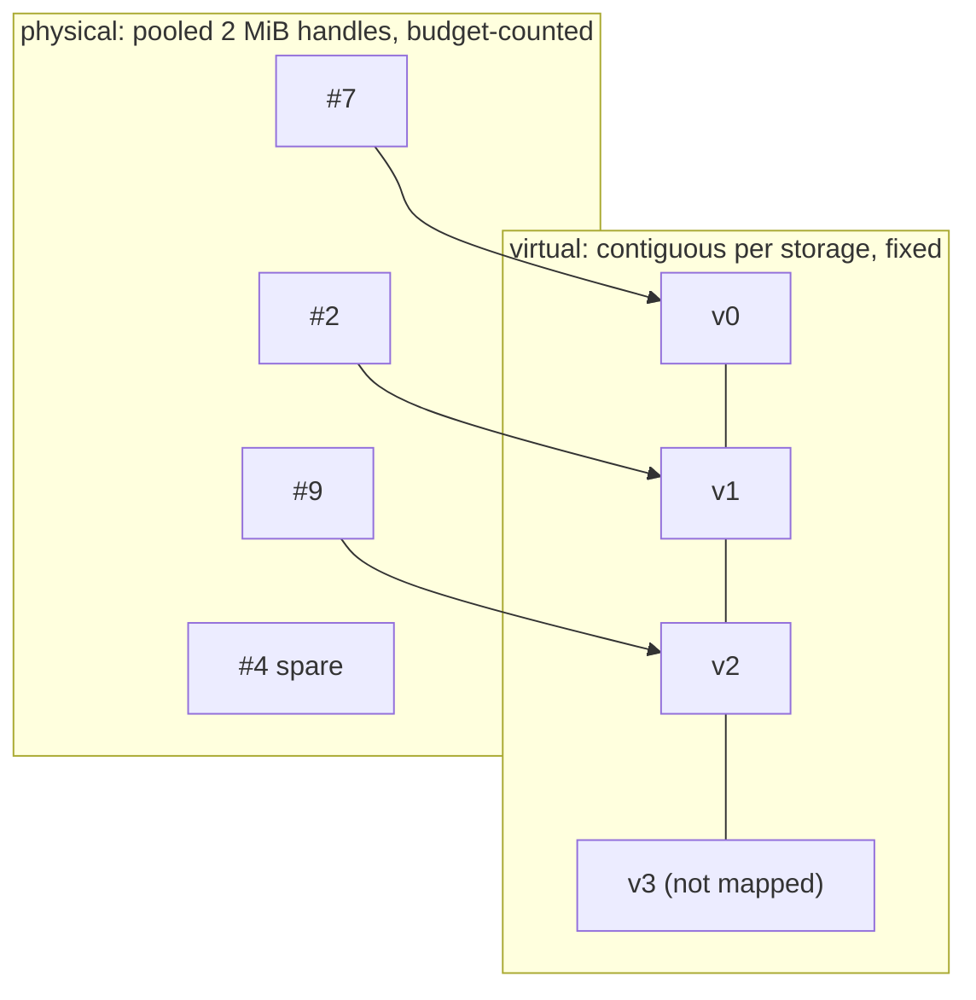

# Virtual and physical memory

Three layers are easy to confuse when a batch's worlds come and go. Each is handled in a different place, and only one of them changes at launch time.

| Layer | What varies | Who resolves it | When |
|---|---|---|---|
| **Occupancy**: which slots hold a live world | slots 0, 1, 3, 4, 6, 9 may be live while 2, 5, 7, 8 are free | the directory, and either compaction or an indirect index inside the kernel | at reset and compaction |
| **Virtual address**: where slot *i* is | nothing; slot *i* is always `base + i × stride` | fixed at allocation | never |
| **Physical pages**: which 2 MiB page backs each part of the range | pages are pooled and not contiguous | the GPU memory management unit, through page tables set by `cuMemMap` | on every memory access, in hardware |

A kernel launched over indices 0 to `live_count − 1` reads slots 0 to `live_count − 1`. It does not know which slots are live, and nothing translates its indices at launch; the only launch-time change is the count itself. If a live world sits at slot 9 while `live_count` is 6, the kernel skips it. Compaction moves the data so the live worlds occupy the lowest slots; alternatively a kernel can read `live_slots[i]` to find its slot, which is a per-element indirection in the kernel body. Virtual-to-physical translation is a separate matter entirely: the kernel only ever sees virtual addresses, and the hardware resolves them to whichever page is mapped there.

The rest of this page is about the second and third layers.

**Virtual address space** is reserved once per `FieldStorage`, as one contiguous range of `capacity × row_stride` bytes rounded up to the driver page, where `capacity` is the planned maximum number of worlds for that prototype. It never moves and never grows. Slot *i* of a field is always at `base + i × row_stride`, from the first allocation until close. This is what makes growth compatible with captured graphs: a kernel node captured with a pointer into the storage keeps a valid pointer as the population grows, because the pointer was into the reservation, not into whatever happened to be mapped. On current GPUs a process can reserve on the order of 2^47 bytes, so reserving for the planned maximum `nworld` costs nothing physical; what bounds the plan is discussed under "Why not reserve more".

**Physical memory** is a pool of page handles, 2 MiB each on current drivers, created with `cuMemCreate` and mapped into virtual pages with `cuMemMap`. Handles are discrete and interchangeable. A handle freed when the G1 storage shrinks can later back a cartpole page. The physical pages behind one storage need not be contiguous and usually are not. The byte budget counts handles, mapped or spare, and nothing else.

The reservations in the figure follow one rule: every storage reserves the whole memory budget, so its planned maximum is the budget divided by its `Data` bytes per world, the most worlds of that prototype the budget could ever hold. A full MuJoCo Warp `Data` record for one world holds far more than `qpos` and `qvel`: body poses, contact records and constraint scratch bring a cartpole world to roughly 1.5 KiB and a G1 world to roughly 24 KiB. Giving both prototypes the same 24 MiB ceiling therefore plans for 16,384 cartpoles and 1,024 G1 worlds. The physical budget in the figure is 32 MiB, less than the 48 MiB reserved: a reservation is a ceiling, not a promise of memory.

The figure keeps the two layers apart. Grow a storage and a handle is drawn from the pool, created if the pool has none and the budget allows, and mapped into the next virtual page. Shrink one and its last handle returns to the spare pool, still counted until `trim` releases it. The virtual bars never change.

## What follows from the split

| Fact | Consequence |
|---|---|
| Virtual range is fixed | Field arrays, bound views and captured kernel nodes hold stable pointers across growth and shrink |
| Mapping is per page | Readiness rounds to pages; one 2 MiB page makes 1,365 cartpole slots ready at once, or 85 G1 slots |
| Handles are pooled | Oscillating populations reuse handles without touching the driver; `trim` is the only release |
| Budget counts handles | A G1 storage consumes a page every 85 slots, a cartpole storage every 1,365. The same budget holds sixteen times fewer G1 worlds |
| Virtual is cheap | Reserve the whole budget for every prototype, so each could hold it alone. What stops the reservation from being larger still is directory metadata and per-batch scan cost, not address space; see below |

## Why not reserve more

Reservation is cheap, so the ceiling could be much higher. Three things stop it from being unlimited, and none of them is the address space.

- **Address space is finite.** A CUDA process has on the order of 128 TiB of user virtual addresses. PyTorch's allocator reserves 1.125 times device memory per segment and documents that over-reserving exhausts that space after a few hundred segments. Many prototypes times several storages each can reach it; one budget-sized reservation per prototype does not.
- **Directory metadata is physical and sized by capacity.** Each slot costs about 28 bytes of ordinary GPU memory and each identity about 24, before any world exists. A directory for a million slots and two million identities holds about 76 MB. The storage reservation is free; the directory that indexes it is not.
- **Publication scans capacity.** `publish` and compaction rescan identity and slot capacity on every batch, so unused capacity has a per-step cost today. Slots, strides and launch dimensions are also int32, which caps one storage at about two billion slots.

The rule that follows: reserve budget ÷ stride slots for every prototype, size the directory to match knowing its cost, and let requests beyond that be rejected rather than grown. More than that could never be filled; less would foreclose a mix the budget could have paid for. Growing past a reservation is a new storage, by design.

## What the package does not do

It does not move a reservation. If a storage needs more slots than were reserved, that is a new storage, not a resize; the design treats reservation as a decision made once. It does not share a physical handle between two virtual ranges, so there is no aliasing of one page from two storages. And it does not make a mapped page accessible by itself: `cuMemSetAccess` is a separate step, and the ledger records whether each page's access was granted, so a failure between map and access is rolled back rather than published.
