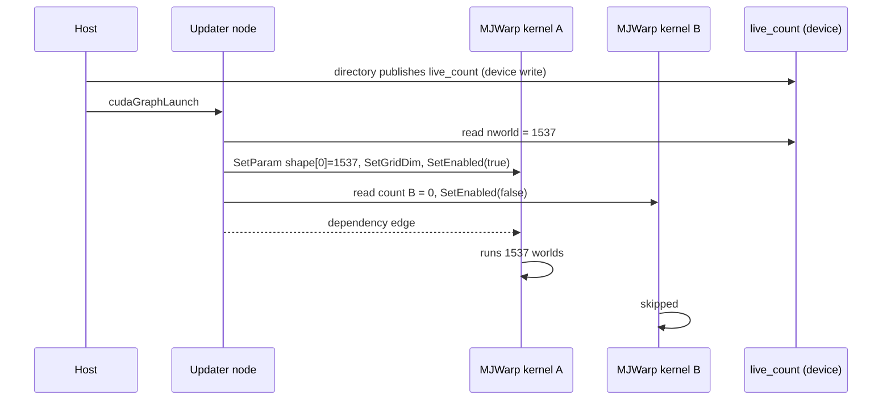

# One graph for any count

A CUDA graph has a fixed structure. The common response to a changing `nworld` is to capture one graph per bucket size and pad the live count up to the next bucket. This package instead opts kernel nodes into CUDA's device-side update facility. An updater node at the start of each replay reads GPU-resident counts and resizes or disables the bound kernel nodes before they execute.

On the bridge's microbenchmark the updater adds about 2 µs per replay, against 25 to 68 percent wasted work for power-of-two padding. The requirement is that every bound kernel is a Warp kernel with the known launch ABI. MJWarp kernels are. Library kernels such as cuBLAS cannot be resized this way, which is why LLM serving systems pad and this package does not.

:::note In MJWarp
With the custom Warp branch, `d.nworld` is a `wp.CountParameter`, and ordinary `wp.launch(kernel, dim=d.nworld, ...)` calls record the occurrence. Newton binds that parameter to `world_storage.protected_count`; `d.naconmax` and `d.naccdmax` bind to the contact and CCD `ready_count`. The numerical code does not change.
:::
