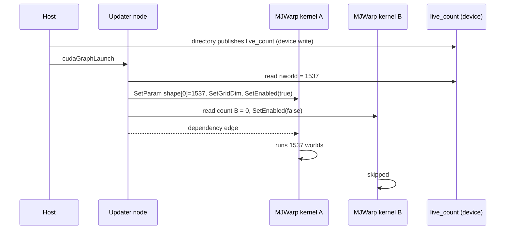

# One graph for any count

A CUDA graph has a fixed structure. The common response to a changing `nworld` is to capture one graph per bucket size and pad the live count up to the next bucket. This package instead opts kernel nodes into CUDA's device-side update facility. An updater node at the start of each replay reads GPU-resident counts and resizes or disables the bound kernel nodes before they execute.

The earlier bridge microbenchmark measured about 2 µs per updater replay. This is not a whole-application speedup measurement. Binding requires a Warp kernel with the known launch ABI; library calls such as cuBLAS need a different integration.

:::note In MJWarp
With custom Warp, `d.nworld` is a `wp.CountParameter`, and ordinary `wp.launch(kernel, dim=d.nworld, ...)` calls record it. Newton binds that parameter to the live world count. It binds `d.naconmax` and `d.naccdmax` to separate contact and CCD counts, limited by readiness across every required storage. The numerical kernels retain their equations; allocations and copies must also carry the appropriate count. See [Integration](../integration.md).
:::
