# GPU Components

GPU-resident instance directory, growable typed storage, virtual-memory backing, and count-driven CUDA graph replay for simulations whose population changes at runtime.

---

## 1. A small example

Take eight cartpoles simulated together on one GPU. Their positions sit in one array of eight rows, their velocities in another, and one kernel updates all eight rows each step. That is a batch simulator, and it is fast because the kernel never asks which rows matter.

Now cartpole number 2 falls over and its episode ends. Cartpole 5 ends a step later. A moment after that, the training loop wants a new cartpole. Three questions appear that the fixed arrays cannot answer:

- Which rows are still in use, and how does a kernel know to skip the rest without a host round trip?
- When the new cartpole takes row 2, how does anything still holding a reference to the old cartpole 2 learn that it is gone?
- If the loop later wants 9 cartpoles, where does the ninth row come from without reallocating the arrays and re-recording the GPU work?

<div class="gc-widget" data-widget="population"></div>
<div class="gc-fallback">

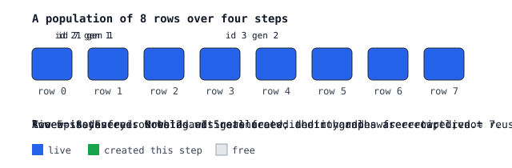

</div>

The figure above is interactive on the documentation site: create instances, click rows to destroy them, compact, grow, and look up a stale handle. The log names the operation and the rule each action exercised.

This package answers those three questions on the device. The rest of this document explains how, starting with the words it uses.

## 2. Vocabulary

These terms appear throughout. Each is defined once here.

| Term | Meaning in this package | In the example |
|---|---|---|
| **instance** | one simulated thing with its own state | one cartpole |
| **prototype** | a kind of instance; all instances of a prototype share the same fields and sit in the same partition of rows | "cartpole"; a second prototype might be "quadruped" |
| **row** or **slot** | one position in the arrays, inside a prototype's partition | row 2 of the cartpole arrays |
| **identity** | a number that names an instance for its whole life and is never reused for another live instance | cartpole id 7 |
| **generation** | a counter attached to an identity that increases every time the identity is published; a reference carries the generation it saw | cartpole 7, generation 3 |
| **handle** | identity plus generation; the stable reference callers keep | `(7, 3)` |
| **location** | prototype plus row; where the instance's state is right now | cartpole partition, row 2 |
| **live** | an identity that currently occupies a row | cartpoles 0, 1, 3, 4, 6, 7 after two episodes end |
| **free** | a row with no instance that the directory may hand out | rows 2 and 5 |
| **admissible** | a row the directory has been told it may use at all; rows above the admissible prefix are off limits even if free | rows 0 to 7 after `publish_admissible_slots` |
| **reserved** | virtual address space set aside for a row, with no physical memory behind it yet | rows 8 to 4095 in a 4096-row reservation |
| **mapped** | a row whose bytes have physical pages behind them | rows 0 to 7 |
| **ready** | a mapped row that has been published as safe for kernels to touch | rows 0 to 7 |
| **protected** | a prefix of rows that may not be unmapped; usually the live count | rows 0 to 7 while any is live |
| **count** | a number of rows to process, held in device memory so no host readback is needed | `live_count = 6` |
| **capture, graph, replay** | recording a sequence of GPU work once, then running the recording repeatedly | one simulation step recorded, replayed every step |
| **publish** | make a device-side fact visible to later work: a new live set, a new ready prefix, a new admissible prefix | `publish` after a batch; `publish_ready` after mapping |
| **join** | wait for every stream that might still be reading something before changing it | before unmapping rows 8 to 15 |
| **batch** | a group of create, replace and destroy requests handled together under one sequence number | "destroy 2 and 5, create one" |
| **compaction** | moving live instances into the lowest rows so a kernel can run over a prefix `[0, live_count)` | moving cartpole 7 from row 7 into row 2 |

## 3. Four parts

In the example, four separate jobs were hiding inside "one array of eight rows." The package gives each job to one module.

| Job, in the example | Module | What it owns |
|---|---|---|
| Know that rows 2 and 5 are free, that cartpole 7 is now at generation 2, and that a reference to generation 1 is stale | `directory` | identities, generations, placement, admission, compaction |
| Hold the position and velocity columns, fill a new row, copy row 7 into row 2 during compaction | `fields` | typed rows, fills, copies, indexed transfers, readiness |
| Have 4096 rows of address space but only pay for the pages behind the rows in use, and add pages when the ninth cartpole arrives | `backing` | virtual reservations, physical pages, a byte budget |
| Record the simulation step once and have it run over 8 rows, then 6, then 7, then 9, without re-recording | `graph` | kernel nodes that resize themselves from a device-side count |

The package has no notion of cartpoles, worlds, or contacts. The engine that uses it supplies those meanings, chooses which count drives which kernel, and orders the work. The package supplies relations, storage, and replay.

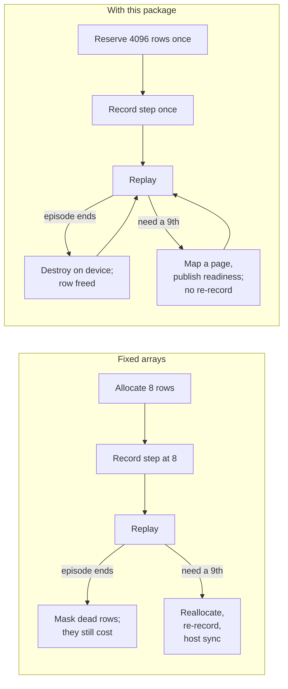

## 4. Structure

```mermaid
flowchart TB
    Engine["Consuming engine<br/>(Newton, MJWarp, or your own)<br/>owns meaning, counts, ordering"]
    Engine --> directory
    Engine --> fields
    Engine --> graph
    subgraph pkg["gpu_components"]
        direction TB
        directory["directory<br/>identity and placement<br/>directory_data.py"]
        fields["fields<br/>typed storage and transfers<br/>field_data.py"]
        backing["backing<br/>virtual bytes and pages<br/>backing_data.py<br/>stdlib + libcuda only"]
        graph["graph<br/>captured bindings<br/>graph_data.py, graph.cu"]
        fields --> backing
        fields -.->|retain, invalidate| graph
        directory -.->|retain, invalidate| graph
    end
    pkg --> Warp["Warp: kernels, arrays, capture"]
    pkg --> CUDA["CUDA driver: VMM, graphs, device node updates"]
```

Two conventions apply throughout.

Records are data and operations are functions. Each `*_data.py` file holds passive records, `wp.struct`s and dataclasses with no methods. Each operation module holds free functions that take those records as arguments. A record's constructor neither allocates nor validates; the operation that produces the record does both.

Each relation has one writer and each task has one canonical operation. Backing is the only writer of the byte ledger. The directory is the only writer of identity and placement. Graph operations are the only writers of capture retention. Where an older path to the same effect still exists, the README names it as a fallback.

Backing imports only the standard library and calls `libcuda.so.1` through `ctypes`. Importing the package does not initialize Warp or CUDA.

---

## 5. Concepts

Each concept below is one of the vocabulary terms made precise, with the operations that read and write it.

### 5.1 Handle and location

An instance has an identity that does not move and a location that can. The directory stores both relations and checks them against each other on lookup.

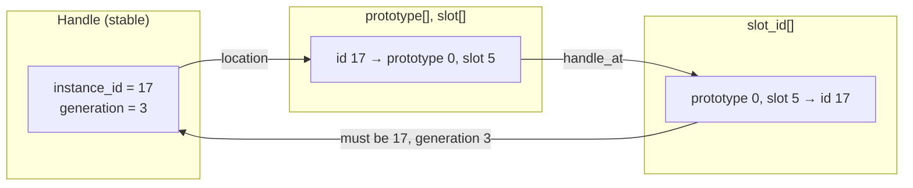

`location(data, id, generation)` returns `(prototype, slot, valid)`. It returns invalid if the generation is stale or if the inverse table disagrees with the forward table. `handle_at(data, prototype, slot)` returns `(id, generation, valid)` and checks the forward table. Both are `wp.func`s and can be called from kernels.

Compaction moves rows and does not change handles. After `publish_compaction`, each live handle resolves to its new row with the same identity and generation.

Generations do not wrap. Each publication of an identity increments its generation. At the maximum value the identity is retired and never reused. A stale handle therefore cannot match a later lifetime of the same identity.

### 5.2 Seven distinct quantities

The following quantities are tracked separately and written by different operations. Treating one as another is the usual source of errors in dynamic GPU memory.

```
row index →  0        live       admissible   ready        mapped       reserved
             |----------|-----------|------------|------------|------------|
             |  live    |  free     | not yet    | mapped,    | virtual    |
             |  rows    |  rows the | admissible | not yet    | addresses  |
             |          |  directory| (needs     | published  | without    |
             |          |  may hand | publish_   | as ready   | physical   |
             |          |  out      | admissible)| (headroom) | pages      |
             |----------|-----------|------------|------------|------------|
                        ↑ protected_count: rows that must not be unmapped
             ↑ execution count: the rows a kernel iterates in this replay
```

| Quantity | Module | Written by |
|---|---|---|
| reserved | backing | `reserve` |
| mapped | backing | `map`, `unmap` |
| ready | fields | `publish_ready`, `resize_backing` |
| protected | consumer | a device int32 that the storage borrows |
| admissible | directory | `publish_admissible_slots`, `withdraw_admissible_slots` |
| live | directory | `publish`, `publish_compaction` |
| execution count | consumer | any device int32 bound to a graph node |

<div class="gc-widget" data-widget="backing"></div>
<div class="gc-fallback">

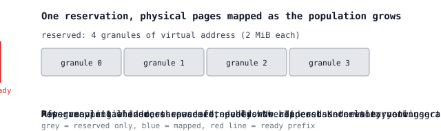

</div>

Mapping bytes does not make rows ready. Readiness does not make rows live. Liveness does not initialize them. Each transition is an explicit operation. This is what allows storage to grow while a captured graph is replaying.

### 5.3 The lifecycle transaction

Creating, replacing and destroying instances happens in a batch identified by a sequence number. The directory executes the batch in three device stages with consumer work between them.

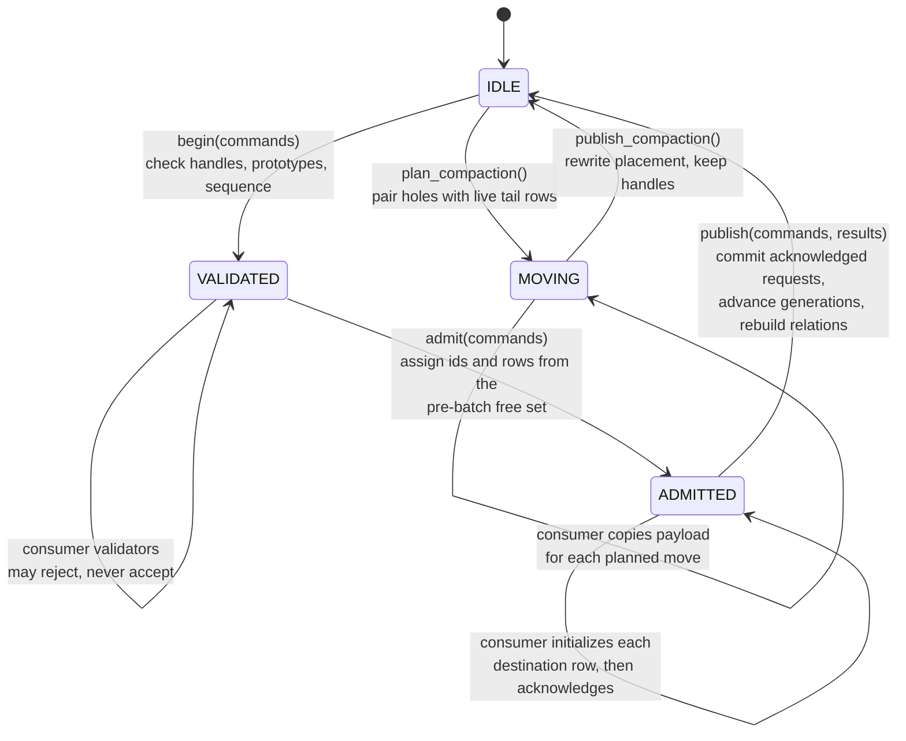

<div class="gc-widget" data-widget="lifecycle"></div>
<div class="gc-fallback">


</div>

Three rules make this safe under a captured graph.

Admission uses a snapshot. Destinations are drawn only from rows and identities that were free before the batch began. Rows freed by this batch become admissible in the next batch. Released rows and admitted rows are disjoint, so publication has no write conflicts.

Replay is idempotent. A batch replayed with the same sequence number returns the previous outcome. A lower sequence number denies advancement. The graph can replay without the host deciding whether the batch is new.

Publication requires acknowledgement. A request that was admitted but not acknowledged is rejected with `INITIALIZATION_MISSING`. A row that was never initialized does not become live.

### 5.4 One graph for any count

A CUDA graph has a fixed structure. The common response to a changing population is to capture one graph per bucket size and pad the live count up to the next bucket. This package instead opts kernel nodes into CUDA's device-side update facility. An updater node at the start of each replay reads GPU-resident counts and resizes or disables the bound kernel nodes before they execute.

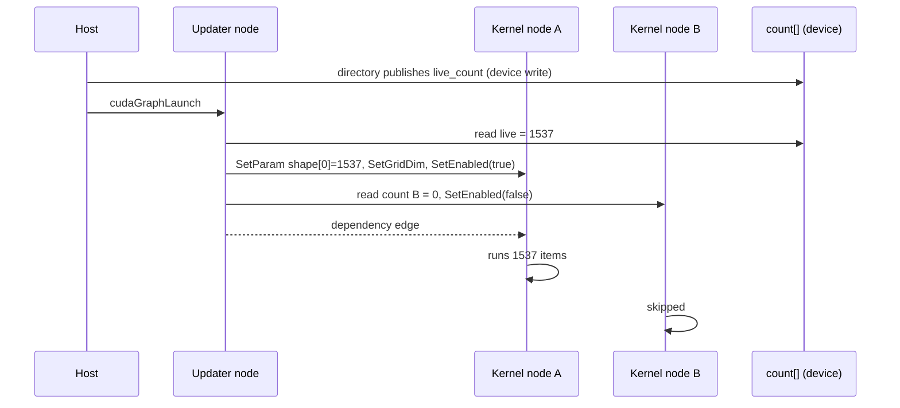

<div class="gc-widget" data-widget="replay"></div>
<div class="gc-fallback">

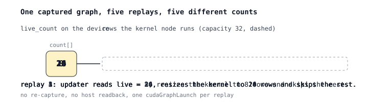

</div>

On the bridge's microbenchmark the updater adds about 2 µs per replay, against 25 to 68 percent wasted work for power-of-two padding. The requirement is that every bound kernel is a Warp kernel with the known launch ABI. Library kernels such as cuBLAS cannot be resized this way, which is why serving systems pad and this package does not.

---

## 6. Quickstart

```python
import warp as wp
from gpu_components import directory, fields
from gpu_components.field_data import FieldSpec

wp.init()

# One prototype, 128 slots.
instances = directory.allocate((128,), id_capacity=256, command_capacity=32)

# Typed storage for that prototype. The live count doubles as the protected prefix.
state = fields.allocate(
    128,
    instances.data.live_count[0:1],
    fields=(FieldSpec("position", (), wp.vec3), FieldSpec("velocity", (), wp.vec3)),
)

# Initialize every row before admitting slots.
for name in ("position", "velocity"):
    fields.prepare_fill(state, state.arrays[name], wp.vec3(0.0))
    fields.fill(state, state.arrays[name], wp.vec3(0.0), count=state.ready_count)

# Allow the directory to hand out rows 0..127.
directory.publish_admissible_slots(instances, (128,))
```

This yields a directory with no live instances, storage with every row initialized, and permission to admit. Without backing, all rows are ready immediately. The tutorial in section 7 creates instances, binds a graph to the live count, and grows storage without re-capturing.

---

## 7. Tutorial

### Step 1. Backing

Backing is optional. Without it, `fields.allocate` uses an ordinary Warp allocation and all rows are ready immediately. With it, you reserve virtual address space for the maximum population and map physical pages as needed.

```python
from gpu_components import backing

CAPACITY = 262144                                      # rows reserved; 2 vec3 fields = 32 bytes per row
budget = 2 * 1024**3                                   # total physical pages, in bytes
pages = backing.prepare(budget, device_ordinal=0)      # requires a current CUDA context

instances = directory.allocate((CAPACITY,), id_capacity=2 * CAPACITY, command_capacity=32)
state = fields.allocate(
    capacity=CAPACITY,
    protected_count=instances.data.live_count[0:1],
    fields=(FieldSpec("position", (), wp.vec3), FieldSpec("velocity", (), wp.vec3)),
    backing=pages,
    initial_ready_count=65536,                         # one 2 MiB granule at 32 bytes per row
)
print(state.ready_rows, fields.memory_report(state)["mapped_packed_bytes"])   # 65536 2097152
```

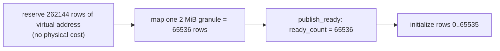

Physical pages are mapped in whole granules, 2 MiB on current drivers. A requested ready count rounds up to the granule boundary, so `initial_ready_count=256` on a 4096-row storage maps and publishes all 4096 rows. Choose a capacity larger than one granule if you need to observe growth.

The budget is checked before any driver call. If a mapping would exceed it, `map` raises `MemoryError` and no state has changed. If the driver fails part way, the ledger is rolled back granule by granule; anything that cannot be rolled back remains owned and is reported in the exception.

### Step 2. Commands

Commands and results are caller-owned `wp.struct`s of device arrays. They are sized once and must stay stable while a graph that uses them may replay.

```python
from gpu_components.directory_data import InstanceOperation

commands = directory.allocate_commands(32, device=instances.device)
results = directory.allocate_results(32, device=instances.device)

def request_creates(n, sequence):
    commands.sequence.fill_(sequence)                         # positive, increasing
    commands.count.fill_(n)
    commands.operation[:n].fill_(int(InstanceOperation.CREATE))
    commands.prototype[:n].fill_(0)
```

Each request has `operation`, `instance_id`, `generation` and `prototype`. `CREATE` ignores the handle fields. `REPLACE` and `DESTROY` require a live handle and otherwise fail with `STALE` or `NOT_ALIVE`.

### Step 3. Initializer

Between `admit` and `publish`, the consumer initializes each admitted destination row and then acknowledges the request by writing the batch sequence number. The directory checks the acknowledgement at publication.

```python
from gpu_components import directory_data
from gpu_components.directory_data import InstanceStatus, InstancePhase

CREATE, REPLACE = int(InstanceOperation.CREATE), int(InstanceOperation.REPLACE)
ADMITTED, OK = int(InstancePhase.ADMITTED), int(InstanceStatus.OK)

@wp.kernel
def initialize_created(
    commands: directory_data.InstanceCommands,
    transaction: directory_data.InstanceTransaction,
    batch: directory_data.InstanceBatchResult,
    position: wp.array[wp.vec3],
    velocity: wp.array[wp.vec3],
):
    i = wp.tid()
    if batch.consumed[0] == 0 or transaction.phase[0] != ADMITTED:
        return
    if i >= commands.count[0] or transaction.status[i] != OK:
        return
    op = commands.operation[i]
    if op != CREATE and op != REPLACE:
        return
    row = transaction.destination_slot[i]          # prototype-local row
    position[row] = wp.vec3(0.0, 0.0, 1.0)
    velocity[row] = wp.vec3(0.0)
    transaction.initialized_sequence[i] = batch.sequence[0]   # acknowledge
```

Warp kernels take module-level integer constants; enum members are converted once at module scope. Write the acknowledgement only after all payload writes for that row have completed. In this kernel the writes and the acknowledgement are in the same thread, so program order is sufficient. If initialization spans several kernels, acknowledge from the last one.

### Step 4. Run a batch

```python
request_creates(16, sequence=1)
directory.begin(instances, commands)
directory.admit(instances, commands)
wp.launch(initialize_created, dim=32,
          inputs=[commands, instances.transaction, instances.batch_result,
                  state.arrays["position"], state.arrays["velocity"]])
directory.publish(instances, commands, results)

print(instances.data.live_count.numpy())                # [16]
print(results.instance_id.numpy()[:16])                 # 16 new identities
print(results.generation.numpy()[:16])                  # all 1
print(instances.batch_result.advance_allowed.numpy())   # [1]: every request succeeded

z = state.arrays["position"][:state.ready_rows].numpy()[:, 2]   # bounded readback
```

Read back only the ready prefix. A field array spans the whole reservation, and `array.numpy()` on the full array copies the unmapped tail and fails with an illegal memory access. Slice to `ready_rows` first, or copy into an accessible snapshot.

`advance_allowed` is the batch-level gate: zero if any request failed. Per-request outcomes are in `results.status`. A consumer whose later work depends on the whole batch should check the gate before proceeding.

### Step 5. A graph bound to the live count

This is the stock-Warp path. The directory batch and the physics kernel are captured once. The kernel's launch extent is bound to the live count.

```python
from gpu_components import graph

@wp.kernel
def integrate(position: wp.array[wp.vec3], velocity: wp.array[wp.vec3], dt: float):
    i = wp.tid()
    position[i] = position[i] + velocity[i] * dt

live = instances.data.live_count[0:1]
updates = graph.prepare_updates(live, enable_count_maximum=4096, binding_capacity=1)

with wp.ScopedCapture() as capture:
    directory.begin(instances, commands)
    directory.admit(instances, commands)
    wp.launch(initialize_created, dim=32, inputs=[...])
    directory.publish(instances, commands, results)

    graph.record_update(updates)                     # the updater precedes bound kernels
    binding = graph.launch(
        updates, integrate, dim=4096,                # captured at capacity
        inputs=[state.arrays["position"], state.arrays["velocity"], 0.01],
        extent_axis=0,                               # axis 0 follows the updater's count
    )

fields.retain_graph(state, capture.graph)            # the graph keeps the storage alive
directory.retain_graph(instances, capture.graph)
graph.bind(updates, capture.graph, [binding])        # mark nodes device-updatable
graph.instantiate_and_upload(updates, capture.graph) # one instantiation, one upload

for step in range(1000):
    # To change the population, edit commands with a new sequence before this call.
    wp.capture_launch(capture.graph)                 # integrate runs over live_count rows
```

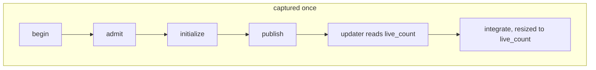

One consequence to plan for. The kernel above iterates the prefix `[0, live_count)`. After the first publication that changes membership, the directory's density certificate is cleared, and later creates are placed from the rebuilt free list in no particular order, not at the lowest rows. Those instances are live, but a prefix kernel does not visit them until a compaction restores the dense prefix. Either compact after admission, as tutorial step 7 does, or index through `live_slots` and never depend on density. On this run, eight instances created after the first batch landed at rows 11166 and 55226 onward and were integrated only after compaction.

With the custom Warp branch the count is declared at the call site instead: a `wp.CountParameter(maximum=4096)` is used as the launch dimension, Warp records the occurrence, and `graph.adopt_launches(..., count_sources=((n, live),))` binds it. See `examples/captured_counts.py`. The binding ledger, the updater and the invariants are the same on both paths.

### Step 6. Grow storage

When the population needs more rows than are ready, map more pages and publish the new readiness. Mapping never-mapped pages does not require waiting for readers, since no kernel can address those pages yet.

```python
needed = 131072                                       # two granules
if fields.can_map_backing_without_join(state, needed):
    mapped_rows = fields.map_backing(state, needed)   # maps and grants access; publishes nothing
    # initialize rows [65536, mapped_rows) on the current stream
    fields.publish_ready(state, mapped_rows)          # device write, ordered on the current stream
    directory.publish_admissible_slots(instances, (mapped_rows,))
```

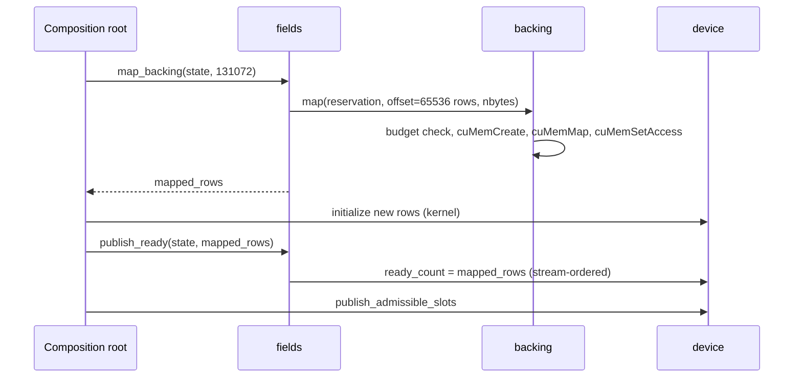

Shrinking is different. Published rows may have readers in flight, so shrinking, remapping a previously mapped address, and retiring storage go through a maintenance scope that synchronizes the streams you name before any mapping changes:

```python
with backing.maintenance(pages, streams=(wp.get_stream().cuda_stream,)):
    fields.resize_backing(state, 60000)   # publish lower readiness, then unmap the second granule
```

Shrinking also rounds to granules: a target of 70000 rows still needs two granules and unmaps nothing, while 60000 rows releases one.

### Step 7. Compaction

Kernels that iterate a prefix need live rows at `[0, live_count)`. Consumers that index through `live_slots` do not need compaction. If you need a dense prefix after destroys: plan the moves, copy the payload, acknowledge, publish.

```python
directory.plan_compaction(instances)              # pairs holes below live_count with live rows above it
moves = instances.compaction                      # source_slots, destination_slots, count per prototype
# copy every retained field for each planned move, then acknowledge:
#   moves.copied_count[p] = moves.count[p]
directory.publish_compaction(instances)           # placement changes; handles do not
```

`fields.prepare_transfer` and `fields.transfer` implement the indexed gather:

```python
plan = fields.prepare_transfer(state, state, ("position", "velocity"))
fields.transfer(plan, moves.source_slots, moves.destination_slots, moves.count[0:1])
moves.copied_count.assign(moves.count.numpy())    # acknowledge every prototype's moves
directory.publish_compaction(instances)
```

Repeated sources are allowed, repeated destinations are rejected, in-place overlap is rejected, and no payload is written unless the on-device validation passes; `plan.status` reports the outcome. After publication the live rows are `[0, live_count)` again and the prefix kernel covers every instance.

### Step 8. Teardown

```python
del capture, plan                                 # graphs and transfer plans first; both retain the storage
import gc; gc.collect()
fields.close(state, streams=(wp.get_stream().cuda_stream,))
directory.close(instances, streams=(wp.get_stream(),))
with backing.maintenance(pages, streams=(wp.get_stream().cuda_stream,)):
    backing.close(pages)
```

`close` refuses while a graph or transfer plan retains the owner. Plans are held weakly and leave only when collected, so drop the reference and collect before closing. If a native cleanup fails, the surviving resources stay in the ledger and a later maintenance scope can retry.

---

## 8. API reference

All operands are explicit records. Costs use I = identity capacity, C = command capacity, S = total slots, P = prototypes.

### `directory`

| Operation | Effect | Cost |
|---|---|---|
| `allocate(slot_limits, *, id_capacity, command_capacity, device)` | Empty directory; no slots admissible | O(I + S + C + P) |
| `allocate_commands(capacity, *, device)` / `allocate_results(...)` | Caller-owned batch buffers | O(C) |
| `begin(directory, commands)` | Validate handles, prototypes, sequence; enter VALIDATED | O(I + C + P) |
| `admit(directory, commands)` | Assign ids and rows from the pre-batch free set; enter ADMITTED | O(C + P) |
| `publish(directory, commands, results)` | Commit acknowledged requests, advance generations, rebuild relations; return to IDLE | O(I + S + C + P) |
| `plan_compaction(directory)` | Plan minimal moves into the dense prefix; enter MOVING | O(S + P) |
| `publish_compaction(directory)` | Apply moves once every copy is acknowledged | O(S + P) |
| `publish_admissible_slots(directory, prefix_ends)` | Make `[0, end)` admissible per prototype; stream-ordered, no readback | O(S + P) |
| `withdraw_admissible_slots(directory, prefix_ends)` | Withdraw a free tail; rejects a live tail; joined | O(S + P) |
| `location(data, id, generation)`, `handle_at(data, prototype, slot)` | `wp.func` lookups for use in kernels | O(1) |
| `retain_graph`, `validate_buffers`, `memory_report`, `close` | Lifetime and accounting | |

Records: `InstanceDirectory`, `InstanceDirectoryData` (read-only relations), `InstanceCommands`, `InstanceResults`, `InstanceBatchResult`, `InstanceTransaction`, `InstanceCompaction`. Enums: `InstanceOperation`, `InstanceStatus`, `InstancePhase`.

### `fields`

| Operation | Effect |
|---|---|
| `allocate(capacity, protected_count, *, fields, backing, initial_ready_count)` | Typed rows; packed fields share one reservation, dense fields are separate arrays |
| `prepare_fill(storage, array, value)`, `fill(storage, array, value, *, count, start)` | Typed fill of rows `[start, count)`; the pattern is prepared before capture |
| `copy(storage, dst, src, *, count)`, `zero(storage, *, count, start)` | Prefix copy between disjoint fields; zero a row suffix |
| `prepare_transfer(src, dst, field_names)`, `transfer(plan, src_idx, dst_idx, count)` | Indexed gather with on-device validation before any write |
| `map_backing(storage, rows)`, `publish_ready(storage, rows)`, `can_map_backing_without_join(...)` | Growth without a reader join; readiness published separately |
| `resize_backing(storage, rows, *, streams, protected_count_host)` | Joined grow or shrink with readiness publication |
| `validate_captured_operation`, `validate_memory_operations` | Check captured fills and copies against storage and count sources |
| `contiguous`, `byte_offset`, `span_bytes`, `pack`, `validate_layout`, `bind`, `validate_array`, `validate_disjoint_arrays` | Layout arithmetic and byte binding; no allocation |
| `lookup`, `retain_graph`, `retain_transfer_graph`, `memory_report`, `transfer_memory_report`, `close` | Lifetime and accounting |

Records: `FieldSpec`, `FieldStorage`, `FieldView`, `FieldTransferPlan`, `StridedLayout`.

### `backing`

| Operation | Effect |
|---|---|
| `prepare(budget_bytes, *, device_ordinal, expected_uuid)` | Bind the current CUDA context and an empty byte ledger |
| `reserve(backing, nbytes)` | Virtual address only; no budget consumed |
| `map(backing, reservation, offset, nbytes)`, `unmap(...)` | Granule-aligned physical mapping with budget check and rollback |
| `can_map_without_join(...)` | True if the range lies beyond every address ever mapped |
| `maintenance(backing, *, streams, events)` | Context manager: synchronize readers, then permit unmap, remap, trim, close |
| `acquire_reference`, `release_reference`, `release_reservation` | Keep a reservation alive while views or graphs refer to it |
| `trim(backing, *, keep_bytes)`, `mapped_ranges(...)`, `memory_report(...)`, `close(...)` | Pool and accounting |

Records: `MemoryBacking`, `VirtualReservation`.

### `graph`

| Operation | Effect |
|---|---|
| `prepare_updates(enable_count, *, enable_count_maximum, binding_capacity)` | Allocate an update table before capture; compiles the CUDA bridge once into a cache |
| `record_update(updates)` | Record the updater node; must precede every bound kernel |
| `launch(updates, kernel, dim, *, inputs, outputs, extent_axis, extent_source, parameters, tiled, ...)` | Stock-Warp path: validate, launch at capacity, return a binding |
| `adopt_launches(updates, graph, launches, *, count_sources, fixed, ...)` | Custom-Warp path: bind recorded launch occurrences to device counts |
| `bind(updates, graph, bindings)` | Mark nodes device-updatable; irreversible; preparation remains pending |
| `instantiate_and_upload(updates, graph)` | Single instantiation, one upload, one synchronize; releases obligations |
| `capture_parallel(branches)` | Fork independent capture branches and join them |
| `current_capture`, `retain`, `invalidate`, `register_last_kernel_node`, `memory_report` | Capture ownership and the low-level fallback |

Records: `GraphUpdateTable`, `GraphKernelBinding`, `KernelParameterBinding`.

---

## 9. Invariants

The tests check these and the docstrings refer to them. A change that violates one needs a stated reason.

| Invariant | Statement |
|---|---|
| Inverse pair | For a live handle, `handle_at(location(h)) = h`; for an occupied location, `location(handle_at(l)) = l` |
| Placement independence | Compaction changes placement and preserves identity and generation |
| Generation | Each publication of an identity advances its generation unless terminal; a terminal identity is retired and never reissued |
| Snapshot admission | Destinations come only from rows and identities free before the batch; no in-batch reuse |
| Eligible conflict | Only requests that validated OK conflict; two valid requests on one identity both reject |
| Acknowledged publication | A request publishes only after its destination is acknowledged; otherwise `INITIALIZATION_MISSING` |
| Idempotent replay | Equal sequence returns the prior outcome; a lower sequence denies advancement |
| Dense prefix | After `publish_compaction`, live rows of a prototype are exactly `[0, live_count)` |
| Conservation | live + free + unavailable = slot limit per prototype; mapped + spare = retained ≤ budget |
| Readiness order | ready ≤ mapped; readiness is published only after mapping and access succeed |
| Join asymmetry | Mapping never-mapped addresses needs no reader join; unmapping, remapping a historical address, overwriting or retiring needs every reader joined |
| Validate before emit | Under capture, validation precedes emission; after any possible partial emission the capture is invalid |
| Updater dependency | Every bound kernel node has a full-completion dependency path from the updater |
| Retained failure | A failed cleanup keeps surviving native resources in the ledger for retry |

---

## 10. Background

The mechanisms here are established ones applied to GPU simulation. The directory is a slab allocator per prototype with versioned references; the version counter is the construction IBM System/370 used in compare-and-swap to prevent reuse errors, and the one NFS file handles use. The inverse table is an inverted page table over a dense id space. The batch protocol is snapshot isolation with sequence numbers as high-water marks. Backing follows the reserve-then-commit model of operating system virtual memory, with the budget as the commit charge. Readiness publication and the maintenance join correspond to RCU publication and grace periods. Compaction is stream compaction.

LLM serving systems address a related problem, and this package adopts their memory practices: map pages before they are needed without waiting for readers, keep freed memory mapped as headroom, and reclaim based on completion events rather than by blocking. It does not adopt their CPU-side scheduler, because a physics step is a fraction of a millisecond and a host scheduler does not fit inside it; the control plane therefore runs on the GPU, as in Madrona. It also does not adopt padded-bucket graphs, because that approach exists for kernels that cannot be resized, and Warp kernels can be.

---

## 11. Qualification

```bash
uv sync
CUDA_VISIBLE_DEVICES='' uv run pytest -q          # CPU: directory kernels run on Warp CPU; fields and graph use fakes
uv run tools/qualify_stock.py dist/*.whl .venv-stock --cuda   # shared contracts on released Warp 1.17, GPU 1
```

The CPU suite covers host bookkeeping and the directory's relations. It does not execute the field row kernels or the native bridge; those need a CUDA device. The stock qualification installs the built wheel against released Warp with no fork and fails if any shared test is skipped. Features that depend on the custom Warp capture branch, count operands and recorded memory extents, have their own test suites and are not claimed on stock Warp.

The tutorial in section 7 was run end to end on an RTX 5090 with released Warp 1.17.0 and CUDA driver 13.0: batch creation, ten queued replays with zero updater errors, in-graph growth to 24 instances, fresh mapping to 131072 rows, a joined shrink, four destroys, a four-move compaction, and teardown.

Requirements: Linux, and a CUDA 12.4 or newer driver for device-updatable graph nodes. The bridge compiles with `nvcc` on first use into Warp's kernel cache. `GPU_COMPONENTS_CUDA_GRAPH_LIBRARY` selects a prebuilt library instead.
