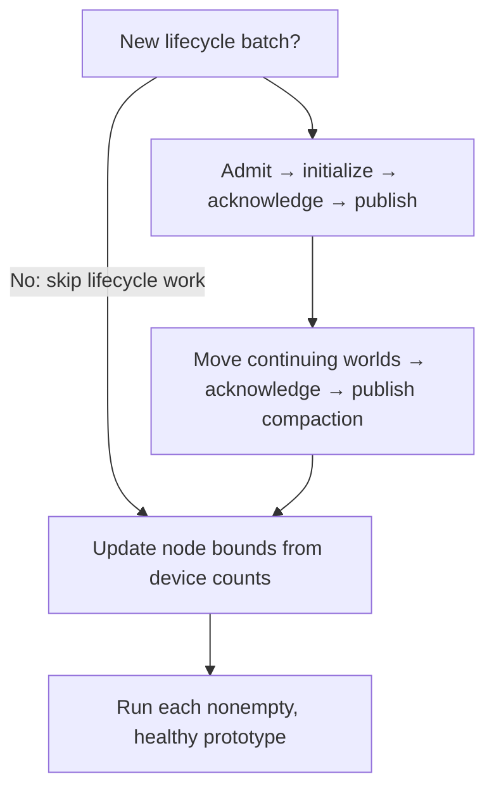

# Integration reference

**Declare scratch where the numerical code uses it. Allocate state and scratch together, once per capacity domain. Bind the complete step before capture.**

This is the preparation flow in the published `codex/scratch-domain-fold` branches, pinned in the [source snapshot](#source-snapshot) below. MJWarp supplies the numerical operations; Newton composes their storage and execution using GPU Components and custom Warp. For the application side, see [IsaacLab configuration, selections and MDP terms](#isaaclab-mdp).

<div className="gc-widget" role="figure" aria-label="Preparation and replay are separate phases">
<strong>Prepare once per prototype</strong>
<div className="gc-phases">
<span className="gc-phase gc-phase-state">Discover declarations</span>
<span className="gc-phase-arrow" aria-hidden="true">→</span>
<span className="gc-phase gc-phase-state">Allocate domains</span>
<span className="gc-phase-arrow" aria-hidden="true">→</span>
<span className="gc-phase gc-phase-state">Bind workspace</span>
<span className="gc-phase-arrow" aria-hidden="true">→</span>
<span className="gc-phase gc-phase-state">Capture program</span>
</div>
<strong>Replay with changing populations</strong>
<div className="gc-phases">
<span className="gc-phase gc-phase-op">Admit and initialize</span>
<span className="gc-phase-arrow" aria-hidden="true">→</span>
<span className="gc-phase gc-phase-op">Publish and compact</span>
<span className="gc-phase-arrow" aria-hidden="true">→</span>
<span className="gc-phase gc-phase-op">Update launch bounds</span>
<span className="gc-phase-arrow" aria-hidden="true">→</span>
<span className="gc-phase gc-phase-op">Run physics</span>
</div>
<div className="gc-note">Scratch discovery runs during preparation. It does not run again at reset.</div>
</div>

## What changes in a numerical stage?

An allocation becomes one named request. The request states its shape and type at the place that needs the array.

**Ordinary allocation**

```python
qDeriv = wp.empty((d.nworld, m.nC), dtype=float)
```

**Current integration** — from `mujoco_warp/_src/forward.py`:

```python
from gpu_components.scratch import scratch_array

qDeriv = scratch_array(d.scratch, "implicit.qDeriv", (d.nworld, m.nC), float)
```

That declaration replaces the separate layout entry, scratch-record field and forwarding parameter. The stage keeps its normal signature. A launch still uses ordinary `wp.launch`; for example, velocity integration remains:

```python
wp.launch(
    _next_velocity, dim=(d.nworld, m.nv),
    inputs=[m.opt.timestep, d.qvel, qacc, 1.0], outputs=[d.qvel],
)
```

For prepared execution, `d.nworld` is a `wp.CountParameter`. Array descriptors still have concrete capacity-sized shapes. Memory operations must state the intended work extent explicitly; owning enough memory does not mean every row should be copied or cleared:

```python
# Example from the Euler stage; this pattern also applies to bounded clears.
wp.copy(M, d.M, extent=(d.nworld, *d.M.shape[1:]))
```

The ordinary allocation path is centralized in `scratch_array`: when `d.scratch` is `None` and the shape is concrete, it calls `wp.empty`. Numerical stages do not each contain a fallback branch. An unprepared symbolic request is rejected instead of silently allocating at its maximum.

## Prepare once in Newton

Newton's `MuJoCoWorlds` constructor owns this sequence. The snippets below are excerpts of the composition, with native Data field enumeration and allocation details omitted.

### 1. Discover declarations and preserve count identity

```python
registry, counts = mjw.discover_step_scratch(
    model, template,
    world_capacity=world_capacity,
    contact_capacity=contact_capacity,
    ccd_capacity=ccd_capacity,
)
```

The template is a concrete, one-world `Data`. Discovery records a native step into a disposable CUDA capture. With the CUDA mempool enabled, its temporary allocations can be recorded as graph nodes. **The discovery graph is never replayed.** It is invalidated after extracting the declarations.

The result is a frozen registry and three distinct count objects: world, contact/candidate and CCD. Keep those exact objects through binding. Two counts with the same maximum can still describe different domains.

### 2. Put scratch in its existing domain

For each prototype, Newton adds the discovered columns to the native Data field lists, then allocates each domain once:

```python
# world_fields and contact_fields already describe native Data.
# ccd_fields starts empty; discovery supplies its scratch columns.
for count, specs in zip(counts, (world_fields, contact_fields, ccd_fields), strict=True):
    specs.extend(
        replace(spec, name="scratch." + spec.name)
        for spec in scratch_ops.column_specs(registry, count)
    )
```

`column_specs` groups declarations by their leading count identity. Names identify columns within preparation; they do not infer a domain or enter GPU membership relations.

<div role="figure" aria-label="One storage owner for each capacity domain" style={{display: 'grid', gridTemplateColumns: 'repeat(auto-fit, minmax(min(100%, 220px), 1fr))', gap: '12px', margin: '1.4em 0'}}>
<div className="gc-widget" style={{margin: 0, minWidth: 0}}>
<strong>World storage</strong>
<p>Native world Data<br/>+ world scratch</p>
<div className="gc-note">Runs over live worlds<br/><code>protected_count</code></div>
</div>
<div className="gc-widget" style={{margin: 0, minWidth: 0}}>
<strong>Contact storage</strong>
<p>Native contact Data<br/>+ candidate scratch</p>
<div className="gc-note">Runs over ready candidate rows<br/><code>ready_count</code></div>
</div>
<div className="gc-widget" style={{margin: 0, minWidth: 0}}>
<strong>CCD storage</strong>
<p>CCD scratch<br/>No separate scratch owner</p>
<div className="gc-note">Runs over ready CCD rows<br/><code>ready_count</code></div>
</div>
</div>

Each domain has one storage owner and one readiness contract. Its fields may use packed virtual reservations or dense allocations; this does not require every field to share one physical allocation.

Count-free scratch, such as scalar counters, stays in ordinary fully backed arrays. A domain with no columns needs no dummy payload allocation; its count metadata still exists. Scratch does not get separate storages, growth targets or compaction plans.

### 3. Bind the complete workspace

Once the three domain storages and fixed arrays exist, Newton builds `columns`, a mapping from each declaration name to its allocated array, and binds once:

```python
scratch_ops.prepare(registry, columns)

bindings = mjw.StepBindings(
    world_storage, contact_storage, ccd_storage,
    fixed_arrays=plain_arrays,
)
workspace = mjw.make_step_workspace(
    model, data, bindings=bindings,
    scratch=registry, count_parameters=counts,
)
```

`prepare` requires exactly one matching array for every declaration. `make_step_workspace` validates the complete binding, including count identity, descriptors, ownership, alignment and disjointness, then snapshots it. There is no later finalization step and no temporarily detached binding.

**The workspace is a borrowed description of an executable step.** It retains the execution view and binding for validation and capture lifetime. It neither allocates another scratch pool nor dispatches the numerical algorithms.

<details>
<summary>What happened to the old preparation machinery?</summary>

The hand-maintained workspace layout and temporary-record plumbing are gone. Discovery obtains the declarations from their use sites. Scratch columns join the existing world/contact/CCD field lists, so extra scratch storage lists and their duplicate service loops disappear. A complete workspace is constructed once, replacing the create-then-finalize protocol.

This removes duplicated declarations and ownership. It does not remove the numerical feature audit, initialization rules or graph-ordering requirements.

</details>

## What changes on graph replay?

Count identities are bound to device scalars. The world storage borrows the directory's published live count as its `protected_count`; contact and CCD execution use their own ready capacities:

```python
count_sources = (
    (workspace.execution_data.nworld, bindings.world_storage.protected_count),
    (workspace.execution_data.naconmax, bindings.contact_storage.ready_count),
    (workspace.execution_data.naccdmax, bindings.ccd_storage.ready_count),
)
```

The contact and CCD counts bound available work buffers, not the number of contacts actually produced. Native counters still describe the produced records.

Newton prepares update tables before recording the real program. After capture, `bind_step_program` validates the recorded operations, their storage/count pairs and updater ordering, then adopts their launch records. The updater reads device counts before the dependent physics nodes execute. Counts can change while array addresses and the captured program remain stable.



Initialization, compaction and physics use parallel per-prototype branches where their dependencies permit. A replay with no new batch skips lifecycle payload work; guards and graph updates still run. Final recording uses already prepared arrays and allocation-free callbacks. The disposable discovery capture is a separate phase.

## Reset state and scratch have different lifetimes

A newly admitted world receives its native Data defaults, followed by the application's initializer. Successful initialization must be acknowledged for that batch before the directory publishes the world. Continuing worlds retain their native Data through the compaction transfer.

**Scratch is excluded from both transfers.** Its first required writes belong to the numerical stages: a clear, copy or overwrite executes whenever the stage needs it. Global contact and solver counters are reset inside the step. Sharing storage with state does not give scratch the same persistence semantics.

Discovery proves which arrays were requested; it does not prove that a kernel writes every value before reading it. Each supported feature still needs that initialization contract and poisoned-memory/first-step parity checks. The current composition also initializes new contact/CCD capacity during backing service; this refactor does not claim to eliminate every reset write.

## Memory service remains explicit

Backing maintenance is host work outside the replay graph. Newton owns when it is safe, which capacities to request and which reader streams must be considered. The caller excludes new submissions during either service call. Later consumers must use the service stream or wait for it; return from growth does not imply GPU completion.

- **`grow_backing(targets, streams=...)`:** mapping a previously unmapped suffix avoids a host reader join. GPU stream dependencies order subsequent initialization and publication. Reusing an address range that was mapped earlier takes the joined maintenance path.
- **`resize_backing(targets, streams=...)`:** the current shrink path joins conflicting readers, withdraws admission, services the backing and publishes coherent readiness. The caller excludes new submissions until it returns.

Map and access-permission calls still take host time. “No host reader join” is not a claim that mapping is free or automatically overlapped. Mapping makes bytes accessible; initialization and publication make new rows usable.

:::note Branch scope
This source snapshot has the joined `resize_backing` path. Event-based deferred withdrawal/reclamation and a background mapping service are not part of this implementation. Every stream that may access the storage must still be accounted for by the caller.
:::

## The application keeps identities, not cached slots

An application stores `(identity, generation)` handles. Immediately before accessing a world, a kernel resolves the current location through the directory:

```python
# Inside an application Warp kernel; illustrative use of the actual lookup API.
prototype, slot, valid = directory.location(data, identity, generation)
if valid:
    # Use this prototype and slot for this ordered operation.
    ...
else:
    # Mark the output invalid instead of leaving an old observation in place.
    ...
```

The lookup validates the handle and membership on the device. A slot is valid for that ordered access; compaction or replacement may change it later. Paths and asset names resolve to numeric prototype-local indices before these operations, in a separate application utility.

Reset requests must publish a coherent command count and sequence. Result processing and handle replacement happen after the lifecycle result is available. Neither the directory nor scratch discovery owns application observations, masks or curriculum policy.

## IsaacLab: configuration → selection → MDP {#isaaclab-mdp}

The MDP is the application end of the integration. It owns episode participation, actions, observations, rewards and reset policy. A task-local selection composes those meanings with Newton's world handles and native physics fields. It does not own physics storage or need to know how scratch was prepared.

The examples here come from the SO101 keyboard task on IsaacLab's `codex/scratch-domain-fold` branch. Paths below are relative to `source/isaaclab_tasks/isaaclab_tasks/contrib/keyboard/`; snippets omit unrelated terms and imports.

### Configure names, bind numeric selections

The configuration remains ordinary IsaacLab manager configuration. From `so101_env_cfg.py`, reduced to the robot observation and action terms:

```python
ROBOT_Q = NewtonSelectorCfg(JOINT_COORD, path=".*/Robot/joints/.*", count_per_world=6)
ROBOT_QD = NewtonSelectorCfg(JOINT_DOF, path=".*/Robot/joints/.*", count_per_world=6)

joint_pos = ObsTerm(func=mdp.joint_pos, params={"joints": ROBOT_Q})
joint_vel = ObsTerm(func=mdp.joint_vel, params={"joints": ROBOT_QD})
action = NewtonRelativeJointPositionActionCfg(
    asset_name=None, joints=ROBOT_Q, dofs=ROBOT_QD, scale=0.02,
)
```

Before managers are constructed, `bind_selectors` replaces each configuration query with a resolved selection. `KeyboardWorlds.resolve` keeps path matching on the preparation side:

```python
def resolve(self, cfg):
    ids = tuple(query_selection_indices(source.model, cfg) for source in self._sources)
    return self._selection_owner.bind(cfg.index_domain, ids, policy_width=cfg.policy_width)
```

`query_selection_indices` belongs to `selection_paths.py`. The binding receives numeric indices per prototype. A coordinate selection and a DOF selection remain different domains even if they have equal widths.

<div className="gc-widget" role="figure" aria-label="IsaacLab selection preparation and runtime access">
<strong>Once, before manager construction</strong>
<div className="gc-phases">
<span className="gc-phase gc-phase-state">Path configuration</span>
<span className="gc-phase-arrow" aria-hidden="true">→</span>
<span className="gc-phase gc-phase-state">Numeric indices per prototype</span>
<span className="gc-phase-arrow" aria-hidden="true">→</span>
<span className="gc-phase gc-phase-state">Bound selection</span>
</div>
<strong>On each MDP access</strong>
<div className="gc-phases">
<span className="gc-phase gc-phase-op">Environment handle</span>
<span className="gc-phase-arrow" aria-hidden="true">→</span>
<span className="gc-phase gc-phase-op">Current prototype + slot</span>
<span className="gc-phase-arrow" aria-hidden="true">→</span>
<span className="gc-phase gc-phase-op">Selected field + participation</span>
</div>
<div className="gc-note">Prototype-local columns stay fixed. World slots can move. The selection resolves the handle when accessing state.</div>
</div>

### Read observations and write actions through the selection

The actual observation terms in `mdp/observations.py` are small:

```python
def joint_pos(env, joints):
    return joints.read_state("joint_q")


def joint_vel(env, joints):
    return joints.read_state("joint_qd")
```

For a fused Warp term, borrow field descriptors instead of first gathering tensors. The key-position observation checks that keys and root share the same environment domain and that there is exactly one selected root:

```python
def key_positions_b(env, keys, root):
    require_same_world_domain(keys, root)
    require_count_per_world(root, 1)
    roots = root.pose_field("state", "body_q")
    key_poses = keys.pose_field("state", "body_q")
    positions = wp.empty(keys.dense_shape, dtype=wp.vec3, device=key_poses.sources.device)
    wp.launch(
        _relative_key_positions, keys.dense_shape,
        inputs=[roots, key_poses], outputs=[positions], device=positions.device,
    )
    return wp.to_torch(positions).flatten(1)
```

Its kernel uses `pose_field_active` and `pose_field_read`. It computes each key's position in the robot-root frame and writes zero for an excluded entry. The same composition applies to an object pose relative to a robot: select the two body sets, validate their relationship, then compute the relative transform.

Actions use the corresponding scalar operations. In `mdp/actions.py`, the action term validates the coordinate/DOF pairing, borrows state, gain, limit and control fields, and launches `_relative_joint_targets`. These are the target-writing lines inside that kernel; `action` has already been scaled by the term:

```python
position = scalar_field_read(q, world, slot)
target = position
if scalar_field_active(qd, world, slot):
    target = position + action[world, slot]

scalar_field_write(target_q, world, slot, target)
scalar_field_write(target_qd, world, slot, 0.0)
scalar_field_write(force, world, slot, 0.0)
```

The full kernel also computes effort telemetry from gains, velocity and effort limits. The descriptor maps the selection's control fields to native storage; the numerical term does not cache a physical world slot.

### Reduce termination results per environment

The configured velocity-limit term consumes the DOF selection, rather than a coordinate selection:

```python
abnormal_robot = DoneTerm(func=mdp.joint_vel_out_of_limit, params={"joints": ROBOT_QD})
```

In the native branch of `mdp/terminations.py`, the manager clears its output, borrows `joint_qd` from state and `joint_velocity_limit` from the model, then launches this kernel. The atomic reduction is required because several DOFs can flag the same environment:

```python
@wp.kernel
def _selected_velocity_limit_violation(velocity: Any, limits: Any, out: wp.array[int]):
    world, slot = wp.tid()
    if scalar_field_active(velocity, world, slot):
        if wp.abs(scalar_field_read(velocity, world, slot)) > scalar_field_read(limits, world, slot):
            wp.atomic_max(out, world, 1)
```

The manager returns `wp.to_torch(self._out).bool()`. It owns the per-environment result; the runtime continues to own the physics fields.

### Mask participation, not ordinary solver sleep

For the growable keyboard task, a six-key prototype has six native keys. The policy can still have 108 key slots. The heterogeneous configuration replaces a fixed topology assertion with `count_per_world=None, policy_width=108`; absent columns are represented by `-1` in the selection map, not by extra physical keys.

A selected element is usable only when all these conditions hold:

1. The task environment participates in this episode.
2. Its identity and generation resolve to a current world, inside the ready prefix.
3. The selected policy slot participates and has a column in that prototype.

`dense_active()` exposes this relation at the tensor boundary. Target/typed-key encodings and action observations consume that mask; pose/scalar field operations enforce it inside fused kernels. Ordinary solver sleep is unrelated: a sleeping body that still belongs to the episode remains a valid observation target.

### Complete the reset before the next MDP read

The environment already exposes an immediate reset operation:

```python
# Existing task API; env_ids and variant_ids are equally sized device int64 tensors.
env.reset_keyboard(env_ids, variant_ids)
```

For scheduled redistribution, `request_variants` records the desired prototype without changing the live episode. `stage_variant_changes` chooses the requests eligible at the current boundary. The reset term then builds or retrieves a complete snapshot of root poses, joint coordinates and velocities.

The important ordering in `KeyboardWorlds` and the typing command is:

1. Preserve final observations from the ending episode when requested.
2. Stage the desired prototype and matching typing state, then finish its physical reset snapshot. IK can use the staged typing target.
3. Publish a new command count and sequence; fill CREATE or REPLACE requests using the current handles.
4. Service required capacity, then run validation, admission, initialization and acknowledgement through Newton.
5. Check results and update environment handles/generations before subsequent MDP reads. Staged typing state is part of the reset boundary; the task resumes only after physical publication succeeds.

After assembling the complete native reset payload, the typing command uses the existing environment entry point:

```python
self._env.restore_reset_snapshot(ids, variants, payload)
```

That calls `KeyboardWorlds.reset_from_snapshot`; it does not write a partial pose directly into the ending world. Continuing worlds retain their state, while replaced worlds receive a new lifetime.

<details>
<summary>Actual request-building kernels in keyboard_worlds.py</summary>

The batch length is assigned, not accumulated from the preceding reset. The generation comes from the environment's current handle. `_submit` launches `_begin_batch` before `_reset_commands`, with one request thread per selected environment:

```python
@wp.kernel
def _begin_batch(commands: InstanceCommands, count: int):
    commands.sequence[0] += wp.uint64(1)
    commands.count[0] = count


@wp.kernel
def _reset_commands(
    commands: InstanceCommands,
    env_indices: wp.array[int],
    variants: wp.array[wp.int64],
    handles: wp.array[int],
    generations: wp.array[wp.uint64],
    create: int,
):
    request = wp.tid()
    env_index = env_indices[request]
    commands.operation[request] = int(InstanceOperation.REPLACE)
    commands.instance_id[request] = handles[env_index]
    commands.generation[request] = generations[env_index]
    commands.prototype[request] = int(variants[request])
    if create != 0:
        commands.operation[request] = int(InstanceOperation.CREATE)
```

These kernels only build requests. Backing service, graph execution, result checking and handle publication remain in `_submit`. A failed publication stops further task access; it does not leave an invalid lifetime masquerading as a successful reset.

</details>

The environment owns Torch/Warp stream ordering across actions, simulation, resets and observations through `warp_on_torch_stream`. Neither an MDP term nor a scratch allocator can establish that ordering on its own.

The task warms each prototype with ordinary `mjw.step(model, warm)` before constructing `MuJoCoWorlds`. Newton then discovers scratch, allocates the domains and binds the complete workspace. The MDP selections and reset APIs above do not participate in that preparation protocol.

## Where each responsibility lives

- **Custom Warp:** symbolic count parameters, bounded launch/memory operations and capture records. It knows no keyboard or world semantics.
- **GPU Components:** passive declarations and storage data, plus operations for scratch preparation, backing, membership and graph binding. Domain grouping follows count identity.
- **MJWarp:** numerical algorithms, scratch requests at use sites, initialization requirements and supported-feature validation.
- **Newton:** the composition root. It owns populations and resources, combines Data and scratch fields, binds counts, and orders initialization, publication, physics and memory service.
- **Application:** stable handles, reset requests, task state and numeric selections.

This path requires the custom Warp count/capture API and CUDA mempool support. Kernels are warmed before population construction. The current prepared physics path admits the validated Newton/implicit-fast, native NxN, sleeping configuration; discovery does not automatically enable other solvers, broadphases or optional features. A changed model layout or step configuration requires fresh preparation.

<details id="source-snapshot">
<summary>Source snapshot for this page</summary>

Published commits for this integration:

- [MJWarp `be0072dd`](https://github.com/ooctipus/mujoco_warp/tree/be0072dd0f0bf43e9459757a854aa5957de971d6): `mujoco_warp/_src/workspace.py`, `step_program.py` and the numerical stages.
- [Newton `e66ed52d`](https://github.com/ooctipus/newton/tree/e66ed52db533b8a65635e4a61f79e4f8733d151f): `newton/_src/solvers/mujoco/worlds.py`.
- [GPU Components `338fa9b3`](https://github.com/ooctipus/gpu-components/tree/338fa9b34f25ca60bc4a3713d79b1115baf68372): `src/gpu_components/scratch.py`, `scratch_data.py` and field operations. Repository access is required.
- [Custom Warp `c48d4e3b`](https://github.com/ooctipus/warp/tree/c48d4e3bd0dc7e1efd5284cd36c558dc95436fda): the existing `capture-launches` dependency.
- [IsaacLab `797565c9`](https://github.com/ooctipus/IsaacLab/tree/797565c9c9da7a8b3ca9a74b33d8a2f7e402ee52): the SO101 task under `source/isaaclab_tasks/isaaclab_tasks/contrib/keyboard/`, including the migrated prototype warm-up. Its dependency pins select the GPU Components, MJWarp and Newton commits above.

The snippets explain the ownership relationships; they are excerpts rather than a complete application.

</details>
