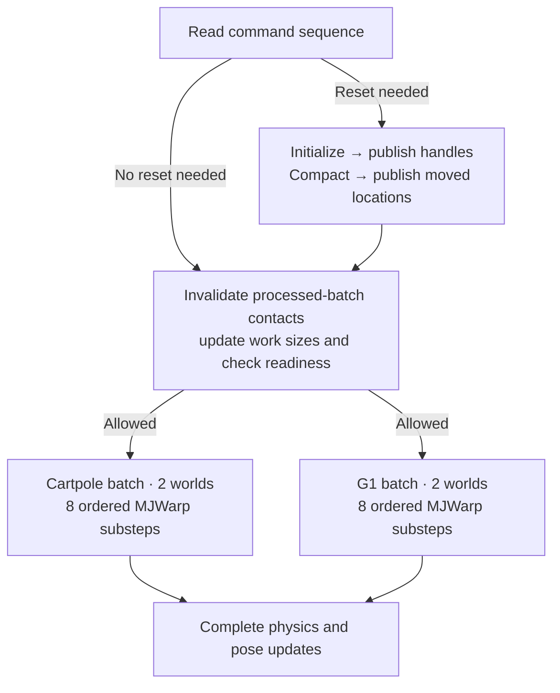

import ResetExample from '@site/src/components/ResetExample';
import Tabs from '@theme/Tabs';
import TabItem from '@theme/TabItem';
import styles from '@site/src/css/integration.module.css';

# Integration, from reset to physics

**When an environment resets into a different scene, three things change: its physics state, where that state is stored, and how many worlds each physics batch processes.**

We prepare each scene in advance. The rest of these docs use Cartpole and G1, or scenes built from bananas and Frankas. Each prepared scene is a *world prototype*. Worlds using the same prototype share a batch of physics arrays.

This page follows one reset using those same examples, then shows the [physics code](#physics-code), [Newton's setup](#newton-setup) and [IsaacLab MDP code](#isaaclab-mdp). The scene diagrams explain the relationships; the code comes from the keyboard implementation at the [published commits below](#source-snapshot), updated October 4, 2026.

**The full application diff is broader than the integration.** Reading and resetting worlds through their handles is part of the task integration. Keyboard generation, typing rewards and command-scheduling optimizations are application choices. They appear in the same IsaacLab branch, but another task does not need to copy them.

**Before → after:** compare [temporary arrays](#temporary-arrays), [copies](#bounded-copies), [graph setup](#graph-before-after) and [task observations](#observation-before-after). Here, **before** means ordinary execution with a fixed population; **after** means this growable integration. The earlier scratch-helper design is shown separately and labeled as history.

## Follow one reset

Three environments, A, B and C, use the first scene. D uses the second. B resets into the second scene. Choose the same example as on the other pages, then compare before and after:

<Tabs groupId="scene" queryString="scene">
<TabItem value="cartpole" label="cartpole and G1" default>

<ResetExample scene="cartpole" />

</TabItem>
<TabItem value="franka" label="banana and Franka">

<ResetExample scene="franka" />

</TabItem>
</Tabs>

The physics arrays keep their starting virtual addresses. **B's new state lives in a different array; its address does change.** C may also move within the first array to fill the hole. C keeps its positions and velocities; B receives a fresh episode state.

This is why the task remembers an environment's world handle, rather than an array row. A handle is an integer identity plus a generation number. The generation changes when that world is replaced, so an old handle cannot accidentally read the new episode. A GPU lookup finds the current prototype and row.

Here is who does what:

- **IsaacLab** chooses B's new scene, computes its reset state, and produces actions, observations and rewards.
- **Newton** checks that there is room, initializes B's new world, preserves continuing worlds, and runs physics.
- **MJWarp** computes contacts, forces and motion, and defines the layout, initialization and transfer semantics of its numerical state.
- **GPU Components** manages the GPU memory and the lookup from a world handle to its current row.
- **Custom Warp** records typed allocations and GPU operations, and lets the recorded operations use changing batch counts.

A *CUDA graph* is the recorded sequence of GPU operations. Here, the sequence stays recorded while the counts change from 3 and 1 worlds to 2 and 2.

## MJWarp and Warp: temporary arrays and world counts {#physics-code}

MJWarp still calls `wp.empty` and `wp.launch`. The important change is **what `d.nworld` contains when Newton records a growable batch**.

### Why the temporary allocation changes {#temporary-arrays}

Suppose we reserve space for **4,096 worlds**, currently have **600 live worlds**, and need **80 temporary values per world**. The width 80 is just an example.

In ordinary execution, `d.nworld` is an integer. When Newton records a growable batch, it is a **`CountParameter` object**. That object stands for a changing GPU count; Newton connects it to the GPU integer that currently holds 600.

```python title="The two values look related, but contain different information"
# Ordinary fixed batch:
d.nworld       # 4096 — a Python integer
d.qLD.shape    # (4096, 80)

# Growable batch during recording:
d.nworld       # CountParameter(maximum=4096) — a parameter object
d.qLD.shape    # (4096, 80) — still the reserved dimensions
# The current value of the parameter lives separately on the GPU: 600.
```

**`empty_like(d.qLD)` reads the array's shape. It does not read `d.nworld`.** It can copy the numbers `(4096, 80)`, but the source array does not carry the link to that changing world count.

<div className={styles.comparison}>
<div>
<strong className={styles.label}>Before · copy the existing array shape</strong>

```python
qLD = wp.empty_like(d.qLD)
```

Information supplied: **`(4096, 80)`**. A fixed-size array request.

</div>
<div>
<strong className={styles.label}>After · pass the world-count parameter</strong>

```python
qLD = wp.empty(
    (d.nworld, *d.qLD.shape[1:]),
    dtype=float, device=d.qpos.device,
)
```

Information supplied: **`(world_count, 80)`**. The first dimension follows this world population.

</div>
</div>

Here `d.nworld` passes the **parameter object**, not the integer 600. `*d.qLD.shape[1:]` keeps the remaining dimensions—in this example, 80. The type and device are written out because `empty_like` used to infer them.

**Why the memory planner needs this:** a plain `(4096, 80)` request is treated as fixed scratch, with all rows allocated. A `(world_count, 80)` request is placed in the prototype's growable world storage. It reserves the same maximum shape, but its physical backing can grow with the usable world capacity instead of always occupying space for every possible world. Backing may include spare rows and page rounding; 600 live worlds does not mean exactly 600 rows are mapped.

The runtime does not allocate a new array every time 600 becomes 900. The array's address and reserved shape remain fixed; enough backing must be ready before the recorded operations use the additional rows.

**This is a limitation of our current API.** During allocation discovery, our Warp fork rejects `empty_like` because it cannot carry this count relationship. The explicit shape is how we supply the missing information today. If the source array or view retained that relationship and `empty_like` inherited it, the original one-line call could remain.

The numerical code still initializes and uses the temporary in the same way. MJWarp does not import GPU Components or receive a scratch-storage argument; Newton handles storage preparation outside the numerical stages.

<details>
<summary>Earlier integration → today: the scratch helper is gone</summary>

This compares our previous integration with today's implementation, **not** upstream MJWarp with the integration.

<div className={styles.comparison}>
<div>
<strong className={styles.label}>Earlier · engine requests named scratch</strong>

```python
from gpu_components.scratch import (
    scratch_array,
)

qDeriv = scratch_array(
    d.scratch, "implicit.qDeriv",
    (d.nworld, m.nC), float,
)
```

</div>
<div>
<strong className={styles.label}>Today · engine uses Warp</strong>

```python
qDeriv = wp.empty(
    (d.nworld, m.nC), dtype=float,
    device=d.qpos.device,
)
```

</div>
</div>

The scratch name, `d.scratch` argument and GPU Components import disappeared from the numerical stage. Storage preparation still exists: Newton owns it, using allocation records supplied by custom Warp. GPU Components provides storage and graph bindings there.

[Earlier source](https://github.com/ooctipus/mujoco_warp/blob/be0072dd0f0bf43e9459757a854aa5957de971d6/mujoco_warp/_src/forward.py) · [Current source](https://github.com/ooctipus/mujoco_warp/blob/34e044b58f1292121e0a906a5e76d96993097341/mujoco_warp/_src/forward.py).

</details>

During preparation, Warp records these allocation requests. Newton prepares their storage and records the program again, supplying the prepared arrays at the `wp.empty` calls. Graph replay runs the recorded GPU operations; it does not run these Python allocation calls again.

Newton marks each complete native step as a temporary lifetime:

```python title="Newton worlds.py — inside the physics callback"
wp.capture_transient(
    lambda: mjw.step(group.model, group.execution_data),
    assume_nonescaping=True,
    assume_no_indirect_access=True,
)
```

The two flags promise that temporary arrays stay inside this call and that their accesses are visible to Warp. The numerical code must initialize the values it needs on every execution. Persistent Data is prepared outside the call.

**Two arrays can share memory only after all uses of the first have finished.** The arrays can have identical shapes and still need separate storage if their operations overlap.

<details>
<summary>How Warp checks whether temporary memory can be reused</summary>

Every temporary access must be visible through recorded regular-array operands, including struct fields and ordinary views that retain their parent. Hidden pointer tables or exported raw pointers do not satisfy this contract. Warp checks the recorded uses and graph ordering; it does not infer arbitrary memory accesses or prove initialization.

Each allocation occurrence keeps its own descriptor. Newton first selects compatible requests by exact count identity, type and shape. Warp then proves that **every use of the earlier allocation completes before every use of the later allocation**. This permits reuse within one step as well as between successive steps. Equal shapes alone never establish a safe lifetime.

The proof uses actual GPU completion edges and adds no synchronization. A use inside a conditional or loop counts as a use of the whole containing node; shared nodes and parallel siblings cannot establish the required order. Unknown native operations disable reuse within that region. The coarser proof that one complete region precedes another remains available under the nonescape contract.

</details>

### Collision storage in the current integration

With sleeping enabled, MJWarp records an initial collision pass and a second pass after updating which bodies are awake. Both passes are inside one native-step region. The earlier whole-region-only planner retained two scratch sets; the allocation-use proof now permits sharing when all first-pass uses finish before the second pass uses the same bytes. MJWarp keeps its ordinary allocations and numerical sequence.

Each allocation still returns a distinct array descriptor, even when the two passes safely share physical storage.

Address-only discovery avoids materializing temporary allocation occurrences during preparation. The final layout still needs physical backing for persistent state and its planned temporary slots. Mapping granularity, readiness and spare backing also contribute to the memory budget.

### Use the current count on each replay

The velocity update computes `velocity += timestep * acceleration`. Its launch has one thread per world and velocity coordinate (`m.nv`):

```python title="Before and after — this numerical launch is unchanged"
wp.launch(
    _next_velocity, dim=(d.nworld, m.nv),
    inputs=[m.opt.timestep, d.qvel, qacc, 1.0], outputs=[d.qvel],
)
```

For an ordinary step, `d.nworld` is an integer. For a recorded, changing-size step, Newton passes `group.execution_data`, where `nworld` is a custom Warp `CountParameter`. It names a changeable count and states its maximum. Allocation records retain that identity, and GPU Components connects recorded operations to the GPU integer holding the current world count.

In the example above, the first scene's launch processes three worlds before reset and two afterward. An update operation reads the count and changes the recorded launch size before physics runs. This does not record a new graph.

### Copy only the current worlds {#bounded-copies}

The final array descriptors describe their maximum reserved size. Copying the entire array would therefore be wrong. This is an actual numerical-code edit:

<div className={styles.comparison}>
<div>
<strong className={styles.label}>Before · copy the full array</strong>

```python
wp.copy(d.qacc_warmstart, d.qacc)
```

</div>
<div>
<strong className={styles.label}>After · copy the live prefix</strong>

```python
wp.copy(
    d.qacc_warmstart, d.qacc,
    extent=(
        d.nworld,
        *d.qacc_warmstart.shape[1:],
    ),
)
```

</div>
</div>

If storage reserves 4,096 worlds and only 600 are live, the second copy touches 600 rows. The custom Warp `extent` argument supplies that changing prefix. This saves the current worlds' accelerations for use in the next step and leaves the remaining reserved rows alone. The original Data object keeps its integer capacities; the separate `execution_data` object supplies the changeable counts to the step.

The allocation, launch and copy excerpts above compare the [fixed-population review baseline](https://github.com/ooctipus/mujoco_warp/blob/d94c382698769968d30bbae333703cf84a2bcb9c/mujoco_warp/_src/forward.py) with the [current integration](https://github.com/ooctipus/mujoco_warp/blob/34e044b58f1292121e0a906a5e76d96993097341/mujoco_warp/_src/forward.py). Their numerical work is the same; how storage and work counts are supplied changes.

## Newton: prepare the arrays and record the step {#newton-setup}

### Before and after graph setup {#graph-before-after}

These are **setup excerpts, not complete applications**. On the left, `model` and fixed-size `data` have already been allocated and warmed up. On the right, `worlds` has been prepared from the prototypes, and `commands` and `results` have been allocated. This small example uses prototype defaults at reset and omits task callbacks.

<div className={styles.comparison}>
<div>
<strong className={styles.label}>Before · record one fixed batch</strong>

```python
with wp.ScopedCapture() as capture:
    for _ in range(8):
        mjw.step(model, data)

graph = capture.graph
```

</div>
<div>
<strong className={styles.label}>After · entry point, expanded below</strong>

```python
from newton.solvers import (
    mujoco_worlds_capture,
)

graph = mujoco_worlds_capture(
    worlds, commands, results,
    substeps=8,
)
```

</div>
</div>

### Inside `mujoco_worlds_capture`

**The right-hand call records a larger program than the left-hand loop.** It combines world replacement, state movement and physics. The shorter call is an application interface; it is not a measure of how much integration code exists.

`worlds` holds each prototype's model, state arrays and storage. `commands` holds GPU requests to create, replace or destroy worlds; `results` holds their outcomes and returned handles. Newton connects those resources to GPU Components and records MJWarp's numerical operations through Warp.

There are two separate jobs: **build the graph during setup**, then **execute its recorded operations on every replay**.

#### During setup: discover, allocate, record again

Before this call, `mujoco_worlds_prepare` has allocated the persistent physics state from one-world prototype templates. The task has warmed the kernels on separate Data. The capture function then:

1. **Records a discovery graph.** Record the reset and physics program shown below. Custom Warp collects temporary allocation requests and their uses. This graph cannot execute; discovery reserves placeholder addresses without backing the full scratch payload.
2. **Prepares scratch storage.** Newton groups requests by their world, contact or CCD count. GPU Components provides the storage. Warp checks operation ordering before Newton assigns the same bytes to different temporaries.
3. **Records the same program again.** Supply the prepared arrays at the numerical code's `wp.empty` calls. This is the graph that will run.
4. **Connects and checks the graph.** Bind changing counts to recorded operations, check memory readiness and count-update ordering, retain the arrays and task buffers, then instantiate and upload the executable.

This is setup work. It is not repeated for every reset or control step.

#### During replay: reset work comes before physics

For the Cartpole/G1 example, B's reset changes the two populations from **3 + 1** to **2 + 2**. The graph first finishes the reset and any movement of continuing worlds, then updates the recorded work sizes. The two physics batches can run as independent graph branches. Each batch's eight substeps remain ordered.



The same graph structure applies to the two banana/Franka scenes. Independent branches permit overlap; they do not guarantee simultaneous execution. A healthy replay with no new request sequence skips reset work. A failed request or failed graph update suppresses physics and pose refresh. Physical page mapping and unmapping happen outside this graph, through the memory service described below.

Here is the recorded program expanded into **pseudocode**. `parallel` means sibling paths in the CUDA graph, not a Python loop that runs on every replay. Conditions are evaluated on the GPU. Error guards are summarized on the final check line.

```text
begin command batch
if reset work is needed:
    validate requests, then admit those that fit
    parallel for each prototype:
        copy defaults into admitted destination rows
        apply task reset values, if supplied
        acknowledge completed initialization
    publish successful replacements and their handles

    plan moves to fill holes left by removed worlds
    parallel for each prototype:
        copy continuing state to the planned destinations
        acknowledge completed moves
    publish the moved worlds' locations

invalidate contact caches if a command batch was processed
update recorded launches from the current GPU counts
check errors, required backing and permission to advance

parallel for each prototype:
    if this batch is allowed to advance:
        apply its action callback, if supplied
        repeat 8 times, in order:
            mjw.step(model, execution_data)
            run its contact callback, if supplied
    refresh poses if enabled and the batch is eligible
```

**Publishing replacements and publishing moved locations are separate operations.** B gets a new world after its reset state is ready. C keeps its state if compaction moves it. Physics starts only after the initialization, movement and count-update work has completed.

The actual native-step recording inside Newton still calls ordinary MJWarp code:

```python title="worlds.py — excerpt from _record_physics"
record_callback(group.before_step)
for _ in range(group.substeps):
    _validate_population(group)
    region = wp.capture_transient(
        lambda: mjw.step(group.model, group.execution_data),
        assume_nonescaping=True,
        assume_no_indirect_access=True,
    )
    if region is not None:
        native_regions.append(region)
    record_callback(group.after_substep)
```

Here, `capture_transient` gives Warp the temporary lifetime described earlier. Newton places this code inside the batch's GPU condition. GPU Components' `capture_parallel` records the independent prototype branches; its `record_update` operations update their recorded work sizes before those branches run.

The keyboard task supplies its own action and reset callbacks. Their `application_bindings` declarations and the memory-growth service remain part of integration; neither is implemented by `mjw.step`.

<details>
<summary>The allocation-capture APIs inside Newton</summary>

This shortened outline shows the two capture passes. `record_program()` below stands for the **expanded GPU program above**, including its conditions and parallel branches; it is an explanatory name, not a separate public API.

```python
with wp.ScopedCapture(
    record_launches=True,
    record_memory_operations=True,
    record_allocations=True,
) as discovery:
    record_program()

requests = wp.capture_get_allocations(discovery.graph)
# Newton selects candidate_pairs by exact count domain, dtype and shape.
ordered = wp.capture_allocation_order(discovery.graph, candidate_pairs)
# Newton prepares bindings: one (original request, final array) pair per occurrence.
# A pair may share backing only when its ordering result is True.

with wp.ScopedCapture(
    record_launches=True,
    record_memory_operations=True,
    allocation_bindings=bindings,
) as final:
    record_program()
```

The discovery pass omits the executable's count-updater operations. The final pass records them, and GPU Components connects the discovered count identities to their GPU sources. Warp rechecks the allocation sequence, descriptors and reuse ordering against the final graph. Newton validates native model and Data descriptors around callbacks and keeps the storage alive for the executable.

`adopt_launches` binds native records to their exact count sources. Task callbacks still declare their recorded launches through `application_bindings`. Recording callbacks run twice and must reproduce their operation structure without host side effects or callback-owned allocations. External edits to the prepared native graph are outside this integration's contract.

</details>

[Read the actual capture function](https://github.com/ooctipus/newton/blob/69f47697e6810bfd74c28182443f3f8c1ca643b1/newton/_src/solvers/mujoco/worlds.py#L886) and [its native-physics recorder](https://github.com/ooctipus/newton/blob/69f47697e6810bfd74c28182443f3f8c1ca643b1/newton/_src/solvers/mujoco/worlds.py#L510).

### Why are there three counts?

A physics step has several kinds of work. One count cannot describe all of them:

- **Worlds:** the number of live worlds in this prototype's batch. In the example, 3 becomes 2.
- **Contact-buffer entries:** how much contact-buffer space is safe to access. This can exceed the number of contacts produced in a step.
- **CCD work-buffer entries:** space for convex collision detection.

World operations use `world_storage.protected_count`, which points to the directory's live count. Newton publishes separate `contact_count` and `ccd_count` values over the prefixes that are ready across every owner in the corresponding domain. A temporary field cannot authorize more rows than its physical backing supports. Actual contact totals have separate counters, such as `data.nacon`.

### What gets copied at reset?

For **B's new episode**, Newton copies the prototype's default physics state and applies the task's reset values. It makes the new world visible to later operations only after initialization succeeds. The code calls this *publication*.

For **continuing C**, Newton copies its existing physics state if it needs to move C to fill a hole. The code calls this *compaction*.

**Temporary scratch is not copied in either case.** Each numerical stage clears, copies or overwrites its required temporary values before using them. MJWarp's native state-transfer rules preserve continuing-world state, including warm starts, while Newton owns the placement and publication sequence. Temporary storage participates in readiness and lifetime management without becoming episode state.

## When does GPU memory grow or shrink?

The example assumes there is already room for B in the second batch. When there is not, Newton must first make more memory usable. Reserving virtual addresses alone does not provide physical GPU memory.

`mujoco_worlds_grow_backing` maps physical memory into more of the reserved address range. Newton grows persistent and temporary storage together, initializes newly usable contact fields from MJWarp's defaults, and publishes only a prefix supported by all required owners. New world state is initialized when admitting the reset requests. Fresh suffix mappings can use GPU stream ordering without joining existing readers on the CPU. The mapping and permission calls still take CPU time.

`mujoco_worlds_resize_backing` can shrink storage. **Shrinking waits for conflicting GPU work before it unmaps memory.** The caller supplies every stream using that memory and excludes new submissions during the change. Temporary storage follows the same retirement rules as persistent storage.

Memory changes happen outside graph replay. The array's virtual starting address stays fixed, allowing the recorded operations to keep using it. Creating worlds still requires enough usable storage within the configured budget. Closing the population requires retiring its graph and completing all readers before releasing backing.

## IsaacLab: write the task terms {#isaaclab-mdp}

The working task uses a robot and keyboards of different sizes. The replacement works like the scene changes above. IsaacLab still owns the MDP: actions, observations, rewards, terminations and resets. The task-local selection API connects those terms to the current physics arrays.

For another task, the essential change is to read and write the world currently owned by each environment, and to update that ownership after a reset. The selectors below are this task's implementation of that lookup. Its typing commands, rewards and robot controller remain task code.

### Choose the joints once

The configuration selects the robot's six joint coordinates and velocities:

```python title="so101_env_cfg.py — selected terms"
from newton import Model

from .selection_paths import NewtonSelectorCfg

ROBOT_Q = NewtonSelectorCfg(Model.AttributeFrequency.JOINT_COORD, path=".*/Robot/joints/.*", count_per_world=6)
ROBOT_QD = NewtonSelectorCfg(Model.AttributeFrequency.JOINT_DOF, path=".*/Robot/joints/.*", count_per_world=6)

joint_pos = ObsTerm(func=mdp.joint_pos, params={"joints": ROBOT_Q})
joint_vel = ObsTerm(func=mdp.joint_vel, params={"joints": ROBOT_QD})
action = NewtonRelativeJointPositionActionCfg(
    asset_name=None, joints=ROBOT_Q, dofs=ROBOT_QD, scale=0.02,
)
abnormal_robot = DoneTerm(func=mdp.joint_vel_out_of_limit, params={"joints": ROBOT_QD})
```

Path matching happens once, before the managers are constructed. `selection_paths.py` converts the paths into numeric joint indices for each prototype. Physics reads and writes use those indices; they do not search strings at every step.

### Read observations and write actions {#observation-before-after}

The earlier task read joint positions from one asset view. The current task uses the selection configured above:

<div className={styles.comparison}>
<div>
<strong className={styles.label}>Before · read the robot asset</strong>

```python
def joint_pos(
    env,
    asset_cfg=SceneEntityCfg("robot"),
):
    asset = env.scene[asset_cfg.name]
    return asset.data.joint_pos.torch[
        :, asset_cfg.joint_ids
    ]
```

</div>
<div>
<strong className={styles.label}>After · read the selected joints</strong>

```python
def joint_pos(env, joints):
    return joints.read_state("joint_q")
```

</div>
</div>

**What changed:** the term receives a selection instead of finding an asset. Both return joint positions in the task's coordinate convention. The selection resolves each environment's current prototype and array row, so the term still works after reset or compaction. The configuration supplies `params={"joints": ROBOT_Q}`.

[Earlier observation](https://github.com/ooctipus/IsaacLab/blob/2b8d48d010f8bbf2caedbde060b7b18e66dd5053/source/isaaclab/isaaclab/envs/mdp/observations.py) · [Current task observation](https://github.com/ooctipus/IsaacLab/blob/efb20421649496eef9b4f40b32613b913dabed70/source/isaaclab_tasks/isaaclab_tasks/contrib/keyboard/mdp/observations.py). Excerpts omit type annotations.

Joint velocities use the same selection pattern:

```python
def joint_vel(env, joints):
    return joints.read_state("joint_qd")
```

The action term uses the same lookup when writing control targets. These lines are inside its Warp kernel; `action` has already been scaled:

```python title="mdp/actions.py — target writes"
position = scalar_field_read(q, world, slot)
target = position
if scalar_field_active(qd, world, slot):
    target = position + action[world, slot]

scalar_field_write(target_q, world, slot, target)
scalar_field_write(target_qd, world, slot, 0.0)
scalar_field_write(force, world, slot, 0.0)
```

Here `world` is the task's environment index and `slot` is a selected joint. Neither is a cached physical array row. The field helpers perform that translation.

<details>
<summary>More MDP code: relative poses and joint-limit termination</summary>

For a term that combines several fields, pass them directly to a Warp kernel. This key-position observation selects one robot root and the keys, then computes their relative positions:

```python title="mdp/observations.py — key positions"
def key_positions_b(env, keys, root):
    require_same_world_domain(keys, root)
    require_count_per_world(root, 1)
    roots = root.pose_field("state", "body_q")
    key_poses = keys.pose_field("state", "body_q")
    positions = wp.empty(keys.dense_shape, dtype=wp.vec3, device=key_poses.sources.device)
    wp.launch(
        _relative_key_positions, keys.dense_shape,
        inputs=[roots, key_poses], outputs=[positions], device=positions.device,
    )
    return wp.to_torch(positions).flatten(1)
```

The kernel calls `pose_field_active` and `pose_field_read`, and writes zero for missing keys. The checks above require both selections to describe the same environments and exactly one root per environment.

The velocity-limit termination clears one output per environment, then runs:

```python title="mdp/terminations.py"
@wp.kernel
def _selected_velocity_limit_violation(velocity: Any, limits: Any, out: wp.array[int]):
    world, slot = wp.tid()
    if scalar_field_active(velocity, world, slot):
        if wp.abs(scalar_field_read(velocity, world, slot)) > scalar_field_read(limits, world, slot):
            wp.atomic_max(out, world, 1)
```

Several joints can flag the same environment, so the write is atomic. The manager returns the per-environment result as `wp.to_torch(self._out).bool()`.

</details>

### Keep missing keys out of the task

A 6-key world has six physical keys. The policy still receives 108 key positions, with the missing entries marked inactive. Key selections use `count_per_world=None, policy_width=108`; the selection map uses `-1` for a missing key.

Observations, target sampling and rewards must respect this mask. `dense_active()` provides it for tensor code; the field helpers check it inside Warp kernels. A body sleeping in the physics solver is still present in the episode and remains observable. A missing key is not.

### Request the reset

```python title="Existing task API"
# Equally sized device int64 tensors: environments to reset and their new variant IDs.
env.reset_keyboard(env_ids, variant_ids)
```

The reset prepares the new poses and velocities and sends replacement requests to Newton. Newton initializes the new worlds before the task resumes. The task then stores the returned handles and reads the new state on the next observation. During `env.step`, the task saves final observations before resetting when requested; calling `reset_keyboard` directly does not save them by itself.

For periodic redistribution, `request_variants` records the desired keyboards and `stage_variant_changes` chooses which requests to apply at the boundary. Requesting a variant does not immediately move a live world.

<details>
<summary>How the reset reaches Newton</summary>

The typing command finishes a complete reset snapshot and calls:

```python
self._env.restore_reset_snapshot(ids, variants, payload)
```

That reaches `KeyboardWorlds.reset_from_snapshot`. Its `_submit` method builds requests, makes enough memory available, runs the recorded reset operations, checks their results, and updates the environment handles. New typing targets can be staged for IK during this process; ordinary task execution resumes only after the physical reset succeeds.

These are the request-building kernels. One new sequence number identifies the reset batch. The request count is assigned afresh:

```python title="keyboard_worlds.py"
@wp.kernel
def _begin_batch(commands: InstanceCommands, count: int):
    commands.sequence[0] += wp.uint64(1)
    commands.count[0] = count


@wp.kernel
def _reset_commands(
    commands: InstanceCommands,
    env_indices: wp.array[int],
    variants: wp.array[wp.int64],
    handles: wp.array[int],
    generations: wp.array[wp.uint64],
    create: int,
):
    request = wp.tid()
    env_index = env_indices[request]
    commands.operation[request] = int(InstanceOperation.REPLACE)
    commands.instance_id[request] = handles[env_index]
    commands.generation[request] = generations[env_index]
    commands.prototype[request] = int(variants[request])
    if create != 0:
        commands.operation[request] = int(InstanceOperation.CREATE)
```

The current generation ensures that the request refers to the world the task actually owns. If reset publication fails, the task stops rather than reading partially initialized state. `warp_on_torch_stream` orders the task's Torch and Warp work across these operations.

</details>

### An optional task optimization: sample commands only at reset

The keyboard configuration also sets `resampling_time_range=None`. This samples a new typing command on explicit reset and skips the per-step timer and search for expired commands. Metrics and typing updates still run each step.

**Growable memory does not require this change.** A task can keep timed command resampling. The old keyboard setting was a 10-second interval with 6-second episodes, so its timer normally never expired during an episode. Removing its timer sampling also changes random-number consumption; it is a separate task optimization, not a promise of identical seeded trajectories.

## Code to review {#source-snapshot}

These links pin the published implementation described above. Start with the source files for each layer's responsibility; the full comparisons also include tests and supporting changes.

- **MJWarp:** [forward.py](https://github.com/ooctipus/mujoco_warp/blob/34e044b58f1292121e0a906a5e76d96993097341/mujoco_warp/_src/forward.py) owns numerical operations and their temporary allocations; [io.py](https://github.com/ooctipus/mujoco_warp/blob/34e044b58f1292121e0a906a5e76d96993097341/mujoco_warp/_src/io.py) defines native field layouts, defaults and state transfer. The [integration comparison](https://github.com/ooctipus/mujoco_warp/compare/d94c382698769968d30bbae333703cf84a2bcb9c...34e044b58f1292121e0a906a5e76d96993097341) starts from a review baseline with sleeping and independent numerical changes already applied, so they are excluded from this diff. It is not a comparison against untouched main.
- **Newton:** [worlds.py](https://github.com/ooctipus/newton/blob/69f47697e6810bfd74c28182443f3f8c1ca643b1/newton/_src/solvers/mujoco/worlds.py) prepares prototype storage, records the graph and orders reset, movement and physics. The [main-to-branch comparison](https://github.com/ooctipus/newton/compare/009158e62b862b3b9d829397d6db583515ae1271...69f47697e6810bfd74c28182443f3f8c1ca643b1) includes work beyond this bridge.
- **Custom Warp:** [capture_allocation.py](https://github.com/ooctipus/warp/blob/52da84604e541b77cc0433b86385de5edb620abc/warp/_src/capture_allocation.py) records allocation requests, supplies prepared arrays and checks reuse ordering. The [main-to-branch comparison](https://github.com/ooctipus/warp/compare/500272ef1c27756788526fd888da089990dd6b83...52da84604e541b77cc0433b86385de5edb620abc) also covers changing counts and bounded memory operations. This repository requires access.
- **GPU Components:** [package source](https://github.com/ooctipus/gpu-components/tree/ec924032fafbe733931d14c2ddfc9f300049c574/src/gpu_components) contains `fields.py`, `graph.py`, `directory.py` and `backing.py`: typed storage, graph bindings, instance lookup and physical backing. This is the full source, not just the latest Warp-compatibility diff. The repository is private.
- **IsaacLab task example:** [keyboard source](https://github.com/ooctipus/IsaacLab/tree/efb20421649496eef9b4f40b32613b913dabed70/source/isaaclab_tasks/isaaclab_tasks/contrib/keyboard) contains the configuration, selections and MDP terms shown here; [keyboard_worlds.py](https://github.com/ooctipus/IsaacLab/blob/efb20421649496eef9b4f40b32613b913dabed70/source/isaaclab_tasks/isaaclab_tasks/contrib/keyboard/keyboard_worlds.py) sends reset requests to Newton. Its [develop-to-branch comparison](https://github.com/ooctipus/IsaacLab/compare/2b8d48d010f8bbf2caedbde060b7b18e66dd5053...efb20421649496eef9b4f40b32613b913dabed70) still includes baseline implementations and optional task optimizations. **It is not a minimal integration patch.**

This integration requires the custom Warp capture implementation and CUDA virtual-memory support. Newton admits the supported keyboard configuration: the Newton solver, implicit-fast integrator and MJWarp's own collision path. Ordinary MJWarp retains its other numerical paths; this does not mean every path can be used by the growable integration. An unseen topology or changed model layout requires new preparation.
