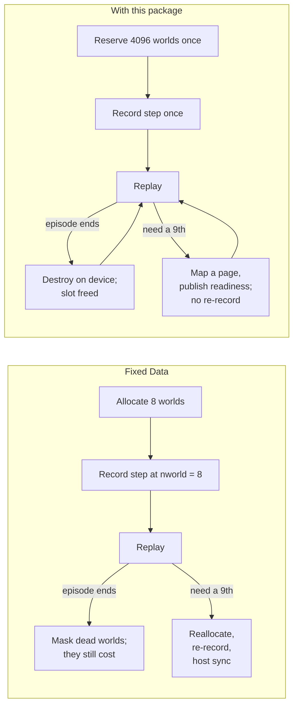

# Four parts

In the example, four separate jobs were hiding inside "one `Data` with eight worlds." The package gives each job to one module.

| Job, in the example | Module | What it owns |
|---|---|---|
| Know that slots 2 and 5 are free, that world 7 is now at generation 2, and that a reference to generation 1 is stale | `directory` | identities, generations, placement, admission, compaction |
| Hold the `qpos` and `qvel` columns, fill a new world's rows, copy world 7 into slot 2 during compaction | `fields` | typed slots, fills, copies, indexed transfers, readiness |
| Reserve 4096 worlds of address space but only pay for the pages behind the worlds in use, and add pages when the ninth world arrives | `backing` | virtual reservations, physical pages, a byte budget |
| Record the simulation step once and have it run over 8 worlds, then 6, then 7, then 9, without re-recording | `graph` | kernel nodes that resize themselves from a device-side count |

The package has no notion of cartpoles, Models or contacts. Newton supplies those meanings, chooses which count drives which kernel, and orders the work. The package supplies relations, storage and replay.



## How the modules relate

```mermaid
flowchart TB
    Engine["Newton, MJWarp, or your own engine<br/>owns meaning, counts, ordering"]
    Engine --> directory
    Engine --> fields
    Engine --> graph
    subgraph pkg["gpu_components"]
        direction TB
        directory["directory<br/>identity and placement<br/>directory_data.py"]
        fields["fields<br/>typed storage and transfers<br/>field_data.py"]
        backing["backing<br/>virtual bytes and pages<br/>backing_data.py<br/>stdlib + libcuda only"]
        graph["graph<br/>captured bindings<br/>graph_data.py, graph.cu"]
        fields --> backing
        fields -.->|retain, invalidate| graph
        directory -.->|retain, invalidate| graph
    end
    pkg --> Warp["Warp: kernels, arrays, capture"]
    pkg --> CUDA["CUDA driver: VMM, graphs, device node updates"]
```

Two conventions apply throughout.

**Records are data and operations are functions.** Each `*_data.py` file holds passive records, `wp.struct`s and dataclasses with no methods. Each operation module holds free functions that take those records as arguments. A record's constructor neither allocates nor validates; the operation that produces the record does both.

**Each relation has one writer and each task has one canonical operation.** Backing is the only writer of the byte ledger. The directory is the only writer of identity and placement. Graph operations are the only writers of capture retention. Where an older path to the same effect still exists, the API pages name it as a fallback.

Backing imports only the standard library and calls `libcuda.so.1` through `ctypes`. Importing the package does not initialize Warp or CUDA.
