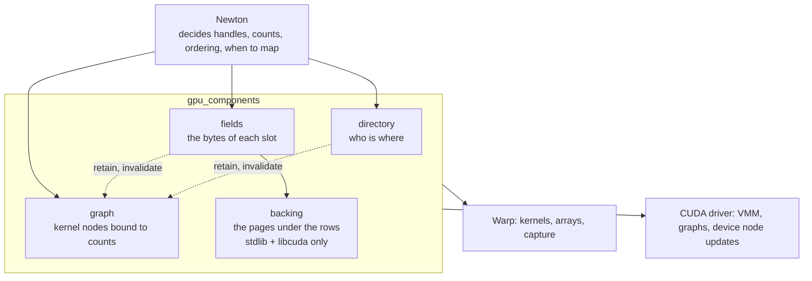

# Four parts

Take the cartpole and G1 scene with 6 cartpoles and 2 G1s live. One reset, in which cartpole world 3's episode ends and the curriculum swaps a G1 into its place while the training loop also wants one more cartpole, touches four kinds of state. Each kind belongs to one module, and nothing else writes it.

| Module | Owns | In the scene, right now |
|---|---|---|
| `directory` | who is where: for each identity its prototype, slot and generation; for each prototype its live count and free slots | identity 3 → cartpole, slot 3, generation 1. `live_count = [6, 2]`. Cartpole slots 6 and up are free |
| `fields` | the bytes of each slot: one packed row per slot holding `qpos`, `qvel` and the other `Data` columns; how many rows are ready | cartpole storage: 1,536 B per row, 5,461 rows ready, rows 0 to 5 hold state |
| `backing` | the pages under the rows: one reserved range per storage, which pages are mapped, the pool, the budget | cartpole range 32 MiB reserved, 4 pages mapped; G1 range 3 pages; pool 9; budget 16 |
| `graph` | the kernel nodes in the captured step and which device count each one follows | `cartpole_step` ← `live_count[0]`, `g1_step` ← `live_count[1]` |

Newton sits above all four. It decides which world a handle means, which count drives which kernel, when to map pages, and in what order to call things. The package never decides any of that.

## One reset through the four parts

Two things to notice. Every call from the directory's `begin` to the graph replay is device work inside the captured step; the host only wrote the commands. And the fields and backing panels barely move: a reset at a fixed mix changes who is where, not where the bytes are.

## Who calls whom

The directory never calls fields or backing, and fields never calls the directory. Newton is the only thing that knows about all of them, which is why a create inside the graph can only ever be placed or rejected: nothing in the directory can reach for pages.

## Two conventions

**Records are data, operations are functions.** Each `*_data.py` file holds plain records with no methods; each operation module holds functions that take them. Constructing a record allocates nothing; the operation that produces it does.

**One writer per relation.** Backing is the only writer of the page ledger, the directory the only writer of identity and placement, graph operations the only writers of capture retention.
