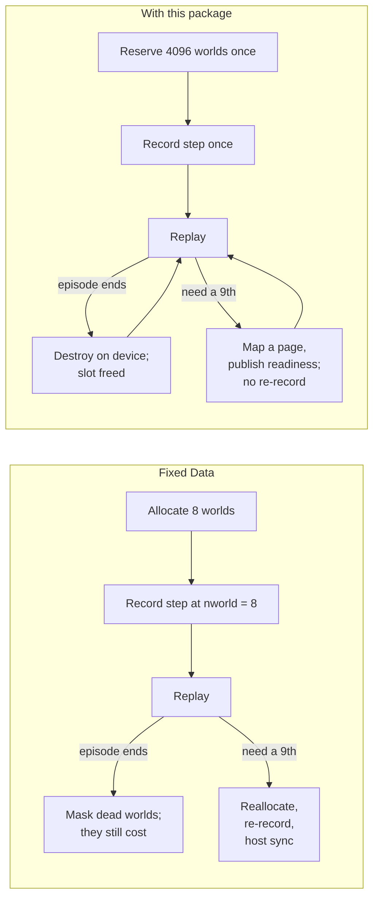

# Four parts

In the example, four separate jobs were hiding inside "one `Data` with eight worlds." The package gives each job to one module.

| Job, in the example | Module | What it owns |
|---|---|---|
| Know that slots 2 and 5 are free, that world 7 is now at generation 2, and that a reference to generation 1 is stale | `directory` | identities, generations, placement, admission, compaction |
| Hold the `qpos` and `qvel` columns, fill a new world's rows, copy world 7 into slot 2 during compaction | `fields` | typed slots, fills, copies, indexed transfers, readiness |
| Reserve address space for 4096 cartpoles and 256 G1s but only pay for the pages behind the worlds in use; count a freed G1 as sixteen cartpoles of budget; add pages when the ninth cartpole arrives | `backing` | virtual reservations, physical pages, a byte budget |
| Record the step once and have the cartpole kernels follow the cartpole count and the G1 kernels follow the G1 count, without re-recording | `graph` | kernel nodes that resize themselves from a device-side count |

The package has no notion of cartpoles, Models or contacts. Newton supplies those meanings, chooses which count drives which kernel, and orders the work. The package supplies relations, storage and replay.



## Two prototypes, one directory, one budget

```
directory.allocate(slot_limits=(4096, 256))      # cartpole slots, G1 slots

slot_starts:   [0,            4096,        4352]
               |--- cartpole partition ---|-- G1 --|
live_count:    [   6         ,     7    ]
free:          [ 4090        ,   249    ]

backing budget, in bytes:
   one cartpole world  ≈  1 unit        one G1 world ≈ 16 units
   freeing G1 slot 5 returns 16 units; creating a cartpole costs 1
```

Each prototype has its own slot partition, its own live and free counts, and its own `FieldStorage` with its own Data layout. All of them draw on one byte budget in `backing`, which is where the sixteen-to-one ratio is enforced: a G1 storage maps sixteen times the bytes per slot, so the same budget holds sixteen times fewer G1 worlds than cartpoles. Each prototype's kernels are bound to that prototype's count, so the G1 step never runs over cartpole slots and vice versa.

## How the modules relate

```mermaid
flowchart TB
    Engine["Newton, MJWarp, or your own engine<br/>owns meaning, counts, ordering"]
    Engine --> directory
    Engine --> fields
    Engine --> graph
    subgraph pkg["gpu_components"]
        direction TB
        directory["directory<br/>identity and placement<br/>directory_data.py"]
        fields["fields<br/>typed storage and transfers<br/>field_data.py"]
        backing["backing<br/>virtual bytes and pages<br/>backing_data.py<br/>stdlib + libcuda only"]
        graph["graph<br/>captured bindings<br/>graph_data.py, graph.cu"]
        fields --> backing
        fields -.->|retain, invalidate| graph
        directory -.->|retain, invalidate| graph
    end
    pkg --> Warp["Warp: kernels, arrays, capture"]
    pkg --> CUDA["CUDA driver: VMM, graphs, device node updates"]
```

Two conventions apply throughout.

**Records are data and operations are functions.** Each `*_data.py` file holds passive records, `wp.struct`s and dataclasses with no methods. Each operation module holds free functions that take those records as arguments. A record's constructor neither allocates nor validates; the operation that produces the record does both.

**Each relation has one writer and each task has one canonical operation.** Backing is the only writer of the byte ledger. The directory is the only writer of identity and placement. Graph operations are the only writers of capture retention. Where an older path to the same effect still exists, the API pages name it as a fallback.

Backing imports only the standard library and calls `libcuda.so.1` through `ctypes`. Importing the package does not initialize Warp or CUDA.
