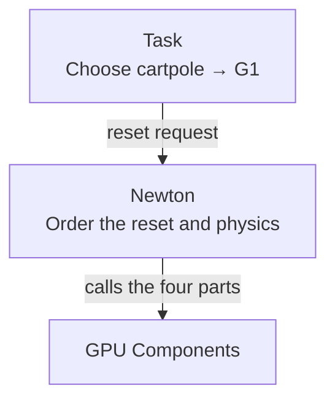
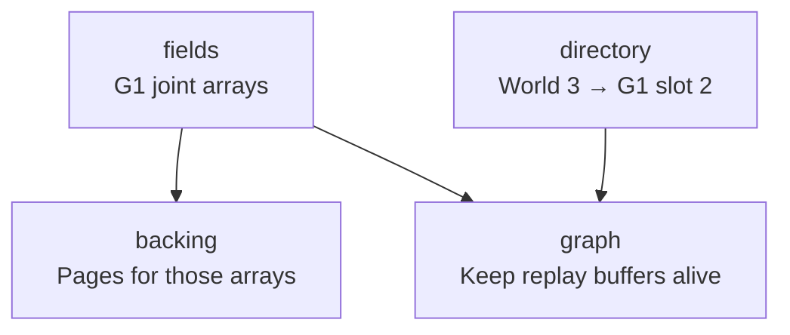

import Tabs from '@theme/Tabs';
import TabItem from '@theme/TabItem';

# Four parts

Take 6 cartpoles and 2 G1s. Replace cartpole world 3 with a G1, and create one additional cartpole. The result is 6 cartpoles and 3 G1s: 9 worlds in total.

Four modules manage the identities, storage, physical memory and captured operations. Their metadata has designated writers. Physics and initialization kernels still write the simulation arrays.

| Module | Owns | In the scene, right now |
|---|---|---|
| `directory` | identity, generation, placement, live counts and admissible free slots | identity 3 → cartpole, slot 3, generation 1. `live_count = [6, 2]`. Cartpole slots 6–5,460 are free and admissible |
| `fields` | typed array storage, row layout, readiness and transfers | illustrative cartpole storage: 1,536 B per packed row, 5,461 rows ready, rows 0–5 hold state |
| `backing` | virtual reservations, physical mappings, retained pool and byte budget | cartpole: 4 pages mapped; G1: 3; pool: 9; total budget: 16 pages |
| `graph` | captured-node bindings, count updates and retained resources | cartpole world-count launches ← `live_count[0]`; G1 world-count launches ← `live_count[1]` |

Newton composes these operations. The task chooses reset requests; Newton connects prototypes to physics, binds counts, and orders initialization, publication and simulation. The directory resolves numeric handles to locations; it does not know what a cartpole is.

The walkthrough uses illustrative row sizes and 2 MiB pages, not measured cartpole or G1 memory footprints. Each prototype reserves enough addresses for the whole budget, but their physical memory shares that budget. Actual MJWarp populations also have separate contact, CCD and temporary storage; some fields use separate dense allocations.

## One reset through the four parts

The CPU launches the graph once. Within that replay, GPU work admits requests, initializes destinations, publishes identities, copies continuing worlds into holes, updates work counts, and then runs physics. The updater follows publication and compaction; it is not the first node.

This example needs no new mappings because both destinations fit in ready storage. The mix changes and some state is written or copied, but the virtual addresses and physical mappings stay fixed. The actual keyboard task also performs host demand/status readbacks and services backing between replays; this walkthrough does not remove those waits.

## Who calls whom

<Tabs lazy>
<TabItem value="decisions" label="Decisions" default>

**Who chooses the next scene?** The task owns rewards, episode termination and the curriculum. It can request “replace world 3 with a G1.” Newton arranges the work needed to carry out that request.

GPU Components knows numeric identities, slots and counts. It does not choose rewards or scenes. Physics is supplied by Newton's solver.

</TabItem>
<TabItem value="calls" label="Module calls">

**Follow world 3 changing from cartpole to G1.** Each arrow means “calls functions in.” The labels show this example's data.

**If the G1 storage needs room:** Newton requests growth. `fields` calls `backing` to map pages for additional G1 rows, before those rows can be used.

**When recording the reset and physics:** `fields` asks `graph` to retain the G1 arrays, such as `qpos` and `qvel`. `directory` asks it to retain the identity and slot buffers used to locate world 3. These buffers must stay alive while the recording uses them. Failed recordings are invalidated.

**If no G1 slot is available:** `directory` rejects the replacement and world 3 remains a cartpole. It cannot call `backing` to acquire pages. Newton can make room and submit a new request batch.

</TabItem>
</Tabs>

For the Warp and CUDA boundaries, see [Integration](integration.md).

## Two conventions

**Records are data, operations are functions.** Each `*_data.py` file holds plain records without authored behavior methods; operation modules hold functions that take them. Constructing a record does not allocate CUDA resources; explicit operations do.

**One writer per relation.** Backing is the only writer of the page ledger, the directory the only writer of identity and placement, graph operations the only writers of capture retention.

That rule applies to owned metadata, not every byte reachable from a record. The engine writes payload arrays and the initialization/copy acknowledgements explicitly required by the directory protocol.
