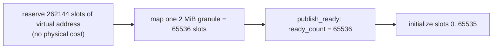
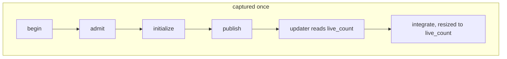
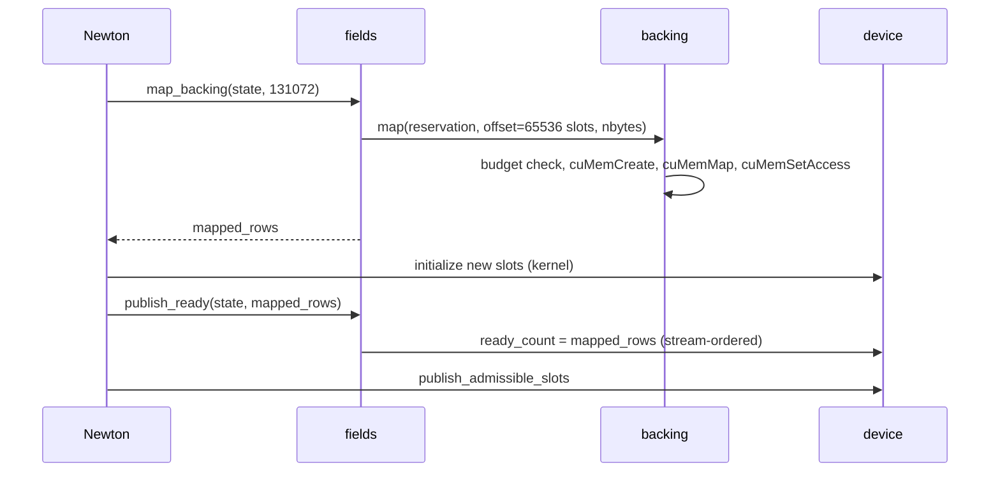

# Tutorial

Eight steps from an empty directory to a graph that follows a changing number of worlds. Every step below was run on an RTX 5090 with released Warp 1.17.0 and CUDA driver 13.0; the printed numbers come from that run.

The example uses a single prototype with two Data arrays, `position` and `velocity`, standing in for `qpos` and `qvel`. Nothing changes for real MJWarp arrays except the field list.

## Step 1. Backing

Backing is optional. Without it, `fields.allocate` uses an ordinary Warp allocation and all slots are ready immediately. With it, you reserve virtual address space for the maximum `nworld` and map physical pages as needed.

```python
from gpu_components import backing, directory, fields
from gpu_components.field_data import FieldSpec

CAPACITY = 262144                                      # slots reserved; 2 vec3 fields = 32 bytes per slot
budget = 2 * 1024**3                                   # total physical pages, in bytes
pages = backing.prepare(budget, device_ordinal=0)      # requires a current CUDA context

worlds = directory.allocate((CAPACITY,), id_capacity=2 * CAPACITY, command_capacity=32)
state = fields.allocate(
    capacity=CAPACITY,
    protected_count=worlds.data.live_count[0:1],
    fields=(FieldSpec("position", (), wp.vec3), FieldSpec("velocity", (), wp.vec3)),
    backing=pages,
    initial_ready_count=65536,                         # one 2 MiB granule at 32 bytes per slot
)
print(state.ready_rows, fields.memory_report(state)["mapped_packed_bytes"])   # 65536 2097152
```



Physical pages are mapped in whole granules, 2 MiB on current drivers. A requested ready count rounds up to the granule boundary, so `initial_ready_count=256` on a 4096-slot storage maps and publishes all 4096 slots. Choose a capacity larger than one granule if you need to observe growth.

The budget is checked before any driver call. If a mapping would exceed it, `map` raises `MemoryError` and no state has changed. If the driver fails part way, the ledger is rolled back granule by granule; anything that cannot be rolled back remains owned and is reported in the exception.

## Step 2. Commands

Commands and results are caller-owned `wp.struct`s of device arrays. They are sized once and must stay stable while a graph that uses them may replay.

```python
from gpu_components.directory_data import InstanceOperation

commands = directory.allocate_commands(32, device=worlds.device)
results = directory.allocate_results(32, device=worlds.device)

CREATE = int(InstanceOperation.CREATE)

def request_creates(n, sequence):
    commands.sequence.fill_(sequence)                         # positive, increasing
    commands.count.fill_(n)
    commands.operation[:n].fill_(CREATE)
    commands.prototype[:n].fill_(0)
```

Each request has `operation`, `instance_id`, `generation` and `prototype`. `CREATE` ignores the handle fields. `REPLACE` and `DESTROY` require a live handle and otherwise fail with `STALE` or `NOT_ALIVE`.

## Step 3. Initializer

Between `admit` and `publish`, the consumer initializes each admitted destination slot and then acknowledges the request by writing the batch sequence number. The directory checks the acknowledgement at publication.

```python
from gpu_components import directory_data
from gpu_components.directory_data import InstanceStatus, InstancePhase

REPLACE = int(InstanceOperation.REPLACE)
ADMITTED, OK = int(InstancePhase.ADMITTED), int(InstanceStatus.OK)

@wp.kernel
def initialize_created(
    commands: directory_data.InstanceCommands,
    transaction: directory_data.InstanceTransaction,
    batch: directory_data.InstanceBatchResult,
    position: wp.array[wp.vec3],
    velocity: wp.array[wp.vec3],
):
    i = wp.tid()
    if batch.consumed[0] == 0 or transaction.phase[0] != ADMITTED:
        return
    if i >= commands.count[0] or transaction.status[i] != OK:
        return
    op = commands.operation[i]
    if op != CREATE and op != REPLACE:
        return
    slot = transaction.destination_slot[i]         # prototype-local world index
    position[slot] = wp.vec3(0.0, 0.0, 1.0)
    velocity[slot] = wp.vec3(0.0)
    transaction.initialized_sequence[i] = batch.sequence[0]   # acknowledge
```

Warp kernels take module-level integer constants; enum members are converted once at module scope. Write the acknowledgement only after all Data writes for that slot have completed. In this kernel the writes and the acknowledgement are in the same thread, so program order is sufficient. If initialization spans several kernels, acknowledge from the last one.

## Step 4. Run a batch

```python
request_creates(16, sequence=1)
directory.begin(worlds, commands)
directory.admit(worlds, commands)
wp.launch(initialize_created, dim=32,
          inputs=[commands, worlds.transaction, worlds.batch_result,
                  state.arrays["position"], state.arrays["velocity"]])
directory.publish(worlds, commands, results)

print(worlds.data.live_count.numpy())                   # [16]
print(results.instance_id.numpy()[:16])                 # 16 new identities
print(results.generation.numpy()[:16])                  # all 1
print(worlds.batch_result.advance_allowed.numpy())      # [1]: every request succeeded

z = state.arrays["position"][:state.ready_rows].numpy()[:, 2]   # bounded readback
```

`advance_allowed` is the batch-level gate: zero if any request failed. Per-request outcomes are in `results.status`. A consumer whose later work depends on the whole batch should check the gate before proceeding.

:::warning Read back only the ready prefix
A field array spans the whole reservation. `array.numpy()` on the full array copies the unmapped tail and fails with an illegal memory access. Slice to `ready_rows` first, or copy into an accessible snapshot. MJWarp's `get_data_into` has the same requirement.
:::

## Step 5. A graph bound to the live count

This is the stock-Warp path. The directory batch and the physics kernel are captured once. The kernel's launch extent is bound to the live world count.

```python
from gpu_components import graph

@wp.kernel
def integrate(position: wp.array[wp.vec3], velocity: wp.array[wp.vec3], dt: float):
    i = wp.tid()
    position[i] = position[i] + velocity[i] * dt

live = worlds.data.live_count[0:1]
updates = graph.prepare_updates(live, enable_count_maximum=CAPACITY, binding_capacity=1)

with wp.ScopedCapture() as capture:
    directory.begin(worlds, commands)
    directory.admit(worlds, commands)
    wp.launch(initialize_created, dim=32, inputs=[...])
    directory.publish(worlds, commands, results)

    graph.record_update(updates)                     # the updater precedes bound kernels
    binding = graph.launch(
        updates, integrate, dim=CAPACITY,            # captured at capacity
        inputs=[state.arrays["position"], state.arrays["velocity"], 0.01],
        extent_axis=0,                               # axis 0 follows the updater's count
    )

fields.retain_graph(state, capture.graph)            # the graph keeps the storage alive
directory.retain_graph(worlds, capture.graph)
graph.bind(updates, capture.graph, [binding])        # mark nodes device-updatable
graph.instantiate_and_upload(updates, capture.graph) # one instantiation, one upload

for step in range(1000):
    # To change the population, edit commands with a new sequence before this call.
    wp.capture_launch(capture.graph)                 # integrate runs over live_count slots
```



:::info Placement after the first publication
The kernel above iterates the prefix `[0, live_count)`. After the first publication that changes membership, the directory's density certificate is cleared, and later creates are placed from the rebuilt free list in no particular order, not at the lowest slots. Those worlds are live, but a prefix kernel does not visit them until a compaction restores the dense prefix. Either compact after admission, as step 7 does, or index through `live_slots` and never depend on density. On this run, eight worlds created after the first batch landed at slots 11166 and 55226 onward and were integrated only after compaction.
:::

With the custom Warp branch the count is declared at the call site instead: `d.nworld` is a `wp.CountParameter(maximum=CAPACITY)` used as the launch dimension, Warp records the occurrence, and `graph.adopt_launches(..., count_sources=((d.nworld, live),))` binds it. See `examples/captured_counts.py` in the package. The binding ledger, the updater and the invariants are the same on both paths.

## Step 6. Grow storage

When more worlds are needed than are ready, map more pages and publish the new readiness. Mapping never-mapped pages does not require waiting for readers, since no kernel can address those pages yet.

```python
needed = 131072                                       # two granules
if fields.can_map_backing_without_join(state, needed):
    mapped_rows = fields.map_backing(state, needed)   # maps and grants access; publishes nothing
    # initialize slots [65536, mapped_rows) on the current stream
    fields.publish_ready(state, mapped_rows)          # device write, ordered on the current stream
    directory.publish_admissible_slots(worlds, (mapped_rows,))
```



Shrinking is different. Published slots may have readers in flight, so shrinking, remapping a previously mapped address, and retiring storage go through a maintenance scope that synchronizes the streams you name before any mapping changes:

```python
with backing.maintenance(pages, streams=(wp.get_stream().cuda_stream,)):
    fields.resize_backing(state, 60000)   # publish lower readiness, then unmap the second granule
```

Shrinking also rounds to granules: a target of 70000 slots still needs two granules and unmaps nothing, while 60000 slots releases one.

## Step 7. Compaction

Kernels that iterate a prefix need live worlds at `[0, live_count)`. Consumers that index through `live_slots` do not need compaction. If you need a dense prefix after destroys: plan the moves, copy the Data, acknowledge, publish.

```python
directory.plan_compaction(worlds)                 # pairs holes below live_count with live slots above it
moves = worlds.compaction                         # source_slots, destination_slots, count per prototype

plan = fields.prepare_transfer(state, state, ("position", "velocity"))
fields.transfer(plan, moves.source_slots, moves.destination_slots, moves.count[0:1])
moves.copied_count.assign(moves.count.numpy())    # acknowledge every prototype's moves
directory.publish_compaction(worlds)              # placement changes; handles do not
```

Repeated sources are allowed, repeated destinations are rejected, in-place overlap is rejected, and no Data is written unless the on-device validation passes; `plan.status` reports the outcome. After publication the live slots are `[0, live_count)` again and the prefix kernel covers every world.

## Step 8. Teardown

```python
del capture, plan                                 # graphs and transfer plans first; both retain the storage
import gc; gc.collect()
fields.close(state, streams=(wp.get_stream().cuda_stream,))
directory.close(worlds, streams=(wp.get_stream(),))
with backing.maintenance(pages, streams=(wp.get_stream().cuda_stream,)):
    backing.close(pages)
```

`close` refuses while a graph or transfer plan retains the owner. Plans are held weakly and leave only when collected, so drop the reference and collect before closing. If a native cleanup fails, the surviving resources stay in the ledger and a later maintenance scope can retry.
